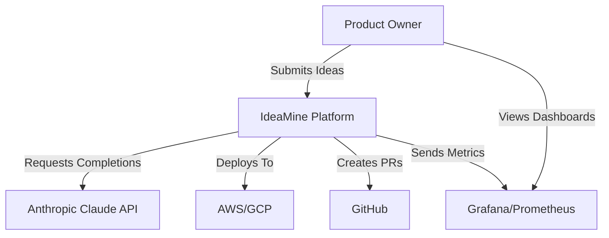
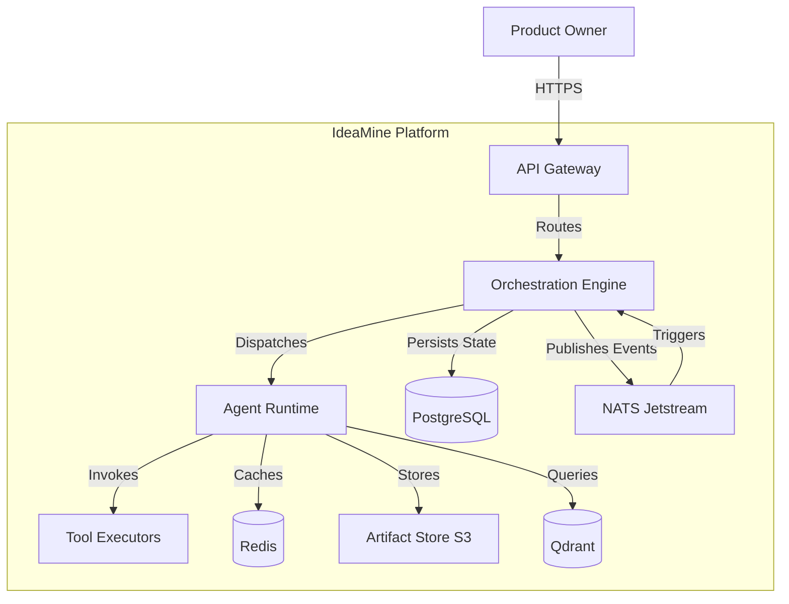
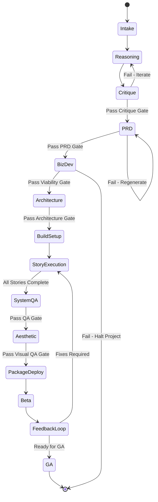

# IdeaMine Product Requirements Document (PRD)

**Version:** 2.0.0 (Unified)
**Date:** 2025-10-18
**Status:** Approved for Development
**Document Owner:** Product & Engineering Leadership

---

## Executive Summary

### Vision Statement

IdeaMine is an autonomous software development platform that transforms raw ideas into production-ready software through a fully orchestrated, AI-powered development lifecycle. By combining intelligent orchestration, multi-agent collaboration, and comprehensive quality gates, IdeaMine delivers what traditionally requires months of human effort in days—while maintaining enterprise-grade quality, security, and compliance standards.

**Mission:** Enable anyone to submit an idea and receive a fully-tested, production-ready application within days—without writing code or managing infrastructure.

### Problem Statement

#### Current State Pain Points

Modern software development faces a fundamental productivity paradox: despite advances in tooling, frameworks, and AI-assisted coding, the idea-to-production timeline remains stubbornly long (6-12 months for MVPs) and resource-intensive (5-10 FTE).

**Critical Challenges:**

1. **Idea-to-Production Gap**: 80% of software ideas never reach production due to resource constraints, planning overhead, and execution complexity
2. **Development Velocity**: Traditional SDLC requires 6-12 months for MVP delivery with teams of 5-10 engineers
3. **Quality vs. Speed Trade-off**: Accelerated development compromises testing, documentation, security reviews, and architectural rigor
4. **Inconsistent Execution**: Human variability leads to missing requirements, architectural shortcuts, inadequate testing, and technical debt
5. **Resource Inefficiency**: Engineering talent consumed by repetitive tasks (boilerplate, config, scaffolding, routine testing)
6. **Knowledge Silos**: Critical context loss between handoffs (product → design → engineering → QA → ops)
7. **Lengthy ideation-to-code cycles** (2-6 months typical)
8. **Incomplete requirements** leading to rework (30-40% of dev time)
9. **Security and compliance gaps** discovered late in cycle
10. **Manual testing bottlenecks** causing release delays
11. **Poor feedback integration** resulting in unaddressed user issues

#### Market Opportunity

**Total Addressable Market (TAM):** $850B global software development market (2025)
- Growth Rate: 11% CAGR through 2030
- AI-Assisted Development Tools: $120B subset (14% of TAM)

**Serviceable Market (SAM):** $120B in AI-assisted development tools and platforms

**Target Segments:**
- **Enterprise Innovation Labs**: 2,500 Fortune 2000 companies with dedicated innovation teams
- **Digital Agencies**: 15,000 agencies with >10 developers globally
- **Venture-Backed Startups**: 50,000 active startups seeking rapid iteration
- **Independent Builders**: Solopreneurs and makers
- **Corporate R&D Teams**: Validating technical concepts

**Serviceable Obtainable Market (SOM):** $1.2B (1% of SAM in year 3)

### Solution Overview

IdeaMine automates the complete software development lifecycle through a **twelve-phase orchestrated pipeline**:

1. **Intake & Spin-Up** → Structured idea capture and project initialization
2. **Deep Ideation** → Market research, user persona development, competitive analysis
3. **Critique Layer (Red-Team)** → Adversarial review challenging assumptions and identifying risks
4. **Product Definition (PRD)** → Comprehensive requirements, user stories, acceptance criteria
5. **BizDev Refinement** → Business model validation, GTM strategy, revenue projections
6. **Architecture & Planning** → System design, tech stack selection, data modeling
7. **Build Setup** → Repository scaffolding, CI/CD, environments, tooling
8. **Story Execution** → Automated coding, testing, code review cycles
9. **System QA** → Integration testing, performance testing, security scanning
10. **Aesthetic Layer** → UI/UX polish, accessibility compliance, brand consistency
11. **Package & Deploy** → Containerization, deployment automation, rollback strategies
12. **Beta → Feedback → GA** → Controlled rollout, telemetry, iteration, general availability

### Key Differentiators

- ✅ **End-to-End Automation**: Idea → GA deployment without manual handoffs
- ✅ **Mandatory Quality Gates**: Automated stage gates enforce standards (Critique, PRD, BizDev, Security, A11y, Visual QA)
- ✅ **Three-Layer Intelligence Model**: Orchestrators plan, Agents decide, Tools execute—with 9 types of specialized "doers"
- ✅ **Analyzer-inside-Agent Pattern**: Agents self-optimize tool usage via Value-of-Information scoring
- ✅ **Production-Grade Outputs**: Security-first, observable, tested, documented, compliant code
- ✅ **Knowledge Continuity**: Every decision, artifact, and metric captured in knowledge graph
- ✅ **Custom Orchestration Engine**: Built from scratch for complete control and scalability
- ✅ **Comprehensive Hallucination Guards**: 16+ dedicated tools + 9 global guardrails

### Success Metrics (12-Month Targets)

#### Business Metrics

- **Idea Completion Rate**: ≥60% of intake ideas reach GA deployment
- **Time to Beta**: <14 days from idea submission to beta release (vs. 90-180 days traditional)
- **Time to GA**: <30 days from idea submission to GA release
- **Cost per MVP**: <$15K fully-loaded cost (vs. $150K-300K traditional)
- **Customer Satisfaction (NPS)**: ≥70 for beta deployments
- **ARR Target**: $10M ARR with 100 enterprise customers @ $100K/year

#### Platform Metrics

- **Pipeline Throughput**: Process 500+ ideas/month at steady state
- **Stage Gate Pass Rate**: ≥85% pass rate at each mandatory gate
- **Automated Code Quality**: ≥90% test coverage, <2% critical vulnerabilities
- **Agent Efficiency**: <$500 LLM cost per project (through tool optimization)
- **System Availability**: 99.9% uptime SLA for orchestration platform

#### Product Metrics (Per Phase)

- **Intake (Phase 1)**: 100% structured capture, <5 min user time
- **Critique (Phase 2a)**: Identify ≥15 risks per project, ≥90% actionable findings
- **PRD (Phase 3)**: Generate ≥50 user stories, 100% acceptance criteria coverage
- **Architecture (Phase 4)**: ≥95% ADR completeness, zero unreviewed tech choices
- **Build (Phase 6-8)**: ≥90% test coverage, ≤5% build failures
- **Beta (Phase 9)**: ≥85% user activation, <10% critical bug rate
- **GA (Phase 12)**: ≤2% production incidents, ≥70 NPS

### Technology Stack Summary

#### Core Orchestration (Custom Built)

- **Custom Workflow Engine**: TypeScript with LangGraph state machines
- **Event Bus**: NATS Jetstream for event-driven architecture
- **State Store**: PostgreSQL 16 (primary state) + Redis 7 (cache/queues)
- **Artifact Storage**: MinIO (S3-compatible) with content-addressing (SHA-256)

#### Agent & LLM Layer

- **Agent Runtime**: LangChain/LangGraph with custom Analyzer-inside-Agent pattern
- **Primary LLM**: Claude 3.7 Sonnet (Anthropic) for reasoning and decision-making
- **Embedding Model**: text-embedding-3-large (OpenAI) for semantic search
- **Vector DB**: Qdrant with hybrid search capabilities

#### Platform Infrastructure

- **Monorepo**: Turborepo + pnpm workspaces
- **Backend**: Node.js 20 + TypeScript, Fastify framework
- **Frontend**: Next.js 15 (App Router), React 19, Tailwind CSS
- **Database**: PostgreSQL 16 (primary), Redis 7 (cache/queues)
- **Container Orchestration**: Kubernetes 1.29+
- **Observability**: OpenTelemetry, Prometheus, Grafana, Loki
- **Secrets**: HashiCorp Vault
- **Feature Flags**: Custom feature flag service

#### Security & Compliance

- **Tool Execution**: gVisor sandboxes (isolated runtimes)
- **Auth**: OAuth 2.1 + OIDC (Keycloak)
- **Encryption**: TLS 1.3 in-transit, AES-256 at-rest
- **Audit**: Immutable audit logs (append-only ledger)

### Timeline & Resources

#### Team Composition (Phased Ramp)

- **Milestone 1 (Months 0-4)**: 6 engineers (2 platform, 2 agents, 1 infra, 1 QA)
- **Milestone 2 (Months 4-7)**: 10 engineers (add 2 agents, 1 platform, 1 security)
- **Milestone 3 (Months 7-10)**: 12 engineers (add 1 agent, 1 SRE)
- **Milestone 4 (Months 10-12)**: 12 engineers (stabilization, optimization)

#### Investment Requirements

- **Engineering**: $3.2M (12 months loaded costs)
- **Infrastructure**: $480K (cloud, LLM API, tooling)
- **Total**: $3.68M to GA readiness

**Go-to-Market Readiness:** Month 12

### Top 3 Risks & Mitigations

| Risk | Impact | Probability | Mitigation |
|------|--------|-------------|------------|
| **LLM Cost Overrun** (>$2K/project) | High | Medium | Analyzer pattern with VOI scoring, per-project budgets, tool result caching, fallback to smaller models |
| **Quality Gate Bottlenecks** (agents stuck failing gates) | High | Medium | Auto-retries with feedback, escalation to human reviewers, gate rubric tuning via ML |
| **Tool Execution Security** (sandbox escapes, data exfiltration) | Critical | Low | gVisor sandboxes, network policies, secret redaction, runtime monitoring, regular pen-testing |

---

## Target User Personas

### Persona 1: Innovation Lab Director (Enterprise)

**Profile:** Sarah Chen, Director of Innovation at Fortune 500 financial services company

**Demographics:**
- Age: 38-45
- Role: Director/VP of Innovation
- Company: Fortune 500 enterprise
- Team: 15-20 people (mix of product, design, engineering)

**Goals:**
- Validate 20+ internal product ideas per year with limited engineering budget
- Demonstrate ROI on innovation initiatives to executive leadership
- Accelerate time-to-market for internal tools and customer-facing products

**Pain Points:**
- Only 10% of ideas get engineering resources allocated
- 6-month MVP timelines mean market opportunities are missed
- Engineering backlog prevents experimentation
- Lack of visibility into why ideas fail or succeed

**Success Criteria:** Test 15+ ideas to beta in 12 months with existing team

**Jobs-to-be-Done:**
- Rapidly prototype and validate business ideas
- Reduce dependency on central engineering teams
- Show measurable innovation impact to stakeholders

---

### Persona 2: Agency CTO (Digital Consultancy)

**Profile:** Marcus Rodriguez, CTO at 50-person digital agency

**Demographics:**
- Age: 32-40
- Role: CTO/VP Engineering
- Company: Digital agency (30-100 employees)
- Team: 15-30 developers

**Goals:**
- Deliver client MVPs faster to win more projects and improve margins
- Scale delivery capacity without proportionally scaling headcount
- Maintain consistent quality across projects with varying team compositions

**Pain Points:**
- Fixed-price projects have thin margins due to requirement changes
- Junior developers need extensive code review
- Client change requests blow up timelines
- Difficult to estimate accurately for new types of projects

**Success Criteria:** Reduce MVP delivery from 12 weeks to 4 weeks, maintain quality

**Jobs-to-be-Done:**
- Accelerate client delivery timelines
- Reduce cost-per-project delivery
- Standardize quality and patterns across projects

---

### Persona 3: Solo Technical Founder (Startup)

**Profile:** Emily Park, founding engineer at pre-seed SaaS startup

**Demographics:**
- Age: 26-35
- Role: Technical Co-Founder / Solo Founder
- Company: Pre-seed to Seed stage startup
- Team: 1-3 people

**Goals:**
- Build and ship multiple product iterations quickly to find PMF
- Maintain technical quality without sacrificing speed
- Preserve runway by minimizing engineering costs

**Pain Points:**
- Wears all hats (frontend, backend, DevOps, QA)
- No time for proper testing, documentation, or security reviews
- Technical debt slows down each new feature
- Difficult to pivot when architecture choices were wrong

**Success Criteria:** Ship 3 major product pivots in 6 months with production quality

**Jobs-to-be-Done:**
- Rapidly iterate on product ideas
- Maintain production-grade quality without a team
- Minimize technical debt accumulation

---

## Competitive Landscape

### Direct Competitors

**Traditional Low-Code Platforms:**
- **Mendix, OutSystems**: Limited to CRUD apps, no custom code flexibility
- **Strengths**: Visual development, non-technical users
- **Weaknesses**: Vendor lock-in, limited complexity, poor developer experience

**AI Code Assistants:**
- **GitHub Copilot, Cursor, Replit Agent**: Developer productivity tools, not end-to-end
- **Strengths**: IDE integration, code completion
- **Weaknesses**: Requires developer expertise, no project management, no deployment

**Dev Platforms:**
- **Vercel, Netlify, Railway**: Deployment/hosting, not development
- **Strengths**: Easy deployment, excellent DX
- **Weaknesses**: No code generation, requires existing codebase

**No-Code Tools:**
- **Bubble, Webflow, Retool**: Non-technical users, limited complexity
- **Strengths**: Visual builders, rapid prototyping
- **Weaknesses**: Performance limitations, vendor lock-in, no custom code

### IdeaMine Positioning

**Full-stack autonomous development with production-grade quality**

**Unique Value:**
- End-to-end automation (Idea → GA deployment)
- Production-grade code (tested, secure, documented)
- Custom code flexibility (not constrained to templates)
- Quality gates enforcing best practices
- Complete observability and auditability

**Target Market Focus:**
- Teams that need production-grade quality
- Projects requiring custom logic and integrations
- Organizations with compliance requirements
- Technical teams seeking velocity, not replacing developers

---

## User Stories & Feature Specifications

### Phase 1: Intake & Project Spin-Up

**Objective:** Capture raw ideas in structured format and initialize project infrastructure in <5 minutes.

#### User Stories

**US-101: Submit Idea as Natural Language**

**As a** product owner
**I want to** describe my idea in plain English/text
**So that** I don't need to learn complex forms or templates

**Acceptance Criteria:**
- Text area supports 100-5,000 characters
- Accepts file attachments (PDFs, images, links)
- Auto-saves drafts every 30 seconds
- Provides character count and guidance prompts
- Supports voice-to-text input

---

**US-102: Guided Idea Extraction**

**As a** platform
**I want to** ask clarifying questions about the submitted idea
**So that** I capture essential context (target users, problem, constraints)

**Acceptance Criteria:**
- System generates 5-10 targeted questions based on idea content
- Questions adapt based on previous answers (conversational flow)
- User can skip questions but warned about incompleteness
- Estimated completion time displayed (<5 min target)
- Saves partial responses for later completion

---

**US-103: Generate IdeaSpec v1 Artifact**

**As a** Intake Orchestrator
**I want to** transform raw input into structured IdeaSpec schema
**So that** downstream phases have consistent inputs

**Acceptance Criteria:**
- IdeaSpec includes: title, description, target users, problem statement, success criteria, constraints
- Schema validates required fields (fail early if missing critical data)
- Generates unique project ID (UUID v7 for time-sortable IDs)
- Stores in artifact store with SHA-256 content hash
- Creates initial project workspace in artifact store

---

**US-104: Assign Budget & Timeline Defaults**

**As a** project administrator
**I want to** set LLM budget caps and SLA targets per project
**So that** costs are controlled and expectations are clear

**Acceptance Criteria:**
- Default budget: $500 (configurable per project tier)
- Default timeline: 14 days to beta
- Budget alerts at 50%, 80%, 95% thresholds
- Timeline displayed with milestones on project dashboard
- Admin can override defaults with justification

---

#### Technical Requirements

**Intake Service (TypeScript/Fastify):**
- REST API: `POST /api/v1/ideas` (submit idea)
- GraphQL API: `mutation SubmitIdea` (for admin console)
- Input validation with Zod schemas
- Rate limiting: 10 submissions/hour per user
- Integration with Intake Agent for extraction

**Intake Agent (LangGraph):**
- Uses Claude 3.7 Sonnet for question generation and extraction
- Tools available: `searchSimilarIdeas`, `validateConstraints`, `estimateComplexity`
- Max token budget: 8K tokens per intake
- Retry logic: 3 attempts with exponential backoff
- Timeout: 2 minutes max processing time

**Data Model:**
```typescript
interface IdeaSpec {
  version: '1.0.0';
  projectId: string;
  submittedBy: string;
  submittedAt: string; // ISO 8601
  title: string;
  description: string;
  targetUsers: string[];
  problemStatement: string;
  successCriteria: string[];
  constraints: {
    budget?: number;
    timeline?: number;
    compliance?: string[];
    techPreferences?: string[];
  };
  attachments: Array<{
    type: string;
    url: string;
    hash: string;
  }>;
  metadata: {
    source: 'web' | 'api' | 'cli';
    complexity: 'low' | 'medium' | 'high';
  };
}
```

---

### Phase 2: Deep Ideation & Strategy

**Objective:** Expand idea into comprehensive discovery pack with market research, user personas, and competitive analysis.

#### User Stories

**US-201: Conduct Market Research**

**As a** Reasoning Agent
**I want to** search for existing solutions, market trends, and user pain points
**So that** the idea is informed by market reality

**Acceptance Criteria:**
- Searches at least 5 data sources (web search, academic papers, patent DB, product directories, forums)
- Identifies 10+ existing solutions in the space
- Summarizes market trends (growing/declining, TAM estimates)
- Flags regulatory/compliance considerations
- Generates references with URLs and access dates

---

**US-202: Create User Personas**

**As a** Reasoning Agent
**I want to** develop 3-5 detailed user personas
**So that** product decisions are grounded in user needs

**Acceptance Criteria:**
- Each persona includes: name, demographics, goals, pain points, behaviors, tech savviness
- Persona archetypes based on research (not fabricated)
- Prioritizes personas by importance (primary, secondary, tertiary)
- Links personas to specific jobs-to-be-done
- Validates personas against IdeaSpec target users

---

**US-203: Map User Journeys**

**As a** Reasoning Agent
**I want to** create journey maps for each persona
**So that** product features align with user workflows

**Acceptance Criteria:**
- Journey maps include: stages, actions, pain points, emotions, opportunities
- Identifies moments of truth and critical touchpoints
- Highlights gaps in current solutions
- Suggests feature opportunities at each stage
- Mermaid diagrams generated for visualization

---

**US-204: Generate DiscoveryPack v1**

**As a** Reasoning Orchestrator
**I want to** compile all research into versioned artifact
**So that** findings are preserved and referenceable

**Acceptance Criteria:**
- DiscoveryPack includes: market analysis, competitive landscape, personas, journeys, opportunities
- All sources cited with URLs and timestamps
- PDF export available for stakeholder review
- Stored in artifact store with versioning
- Linked to IdeaSpec in knowledge graph

---

#### Technical Requirements

**Reasoning Service:**
- Integrates with web search APIs (Tavily, SerpAPI)
- Academic search: Semantic Scholar API
- Patent search: USPTO API
- Concurrent research tasks (parallelized)
- Caching: 7-day TTL for search results

**Reasoning Agents:**
- Market Research Agent (budget: 20K tokens)
- Persona Development Agent (budget: 15K tokens)
- Journey Mapping Agent (budget: 10K tokens)
- Tools: `webSearch`, `academicSearch`, `patentSearch`, `forumSearch`, `generatePersona`, `createJourneyMap`

**Data Model:**
```typescript
interface DiscoveryPack {
  version: '1.0.0';
  projectId: string;
  generatedAt: string;
  marketAnalysis: {
    tam: string;
    trends: string[];
    competitors: Array<{
      name: string;
      url: string;
      strengths: string[];
      weaknesses: string[];
    }>;
    regulations: string[];
  };
  personas: Array<{
    id: string;
    name: string;
    priority: 'primary' | 'secondary' | 'tertiary';
    demographics: object;
    goals: string[];
    painPoints: string[];
    behaviors: string[];
  }>;
  journeyMaps: Array<{
    personaId: string;
    stages: Array<{
      name: string;
      actions: string[];
      painPoints: string[];
      opportunities: string[];
    }>;
  }>;
  sources: Array<{
    url: string;
    title: string;
    accessedAt: string;
  }>;
}
```

---

### Phase 2a: Critique Layer (Red-Team) - MANDATORY GATE

**Objective:** Adversarial review to challenge assumptions, identify risks, and stress-test viability before investing in PRD/development.

#### User Stories

**US-2A1: Challenge Core Assumptions**

**As a** Critique Agent
**I want to** identify and challenge every assumption in IdeaSpec and DiscoveryPack
**So that** unvalidated beliefs don't derail the project

**Acceptance Criteria:**
- Extracts all explicit and implicit assumptions
- Rates each assumption confidence (high/medium/low)
- Proposes validation experiments for low-confidence assumptions
- Flags assumptions that contradict market research
- Generates assumption register with risk ratings

---

**US-2A2: Identify Technical Risks**

**As a** Critique Agent (Technical)
**I want to** assess feasibility, scalability, and security risks
**So that** technical blockers are surfaced early

**Acceptance Criteria:**
- Reviews technical constraints from IdeaSpec
- Identifies potential scaling bottlenecks
- Flags security/privacy risks (PII handling, auth, data residency)
- Assesses dependency risks (third-party APIs, vendors)
- Rates overall technical risk (low/medium/high/critical)

---

**US-2A3: Competitive Threat Analysis**

**As a** Critique Agent (Market)
**I want to** play devil's advocate on market viability
**So that** we understand competitive moats and threats

**Acceptance Criteria:**
- Asks "why hasn't this been done before?"
- Identifies competitive moats (or lack thereof)
- Assesses switching costs from existing solutions
- Evaluates go-to-market challenges
- Proposes differentiation strategies

---

**US-2A4: Generate CritiqueReport v1**

**As a** Critique Orchestrator
**I want to** compile all red-team findings into actionable report
**So that** product/eng can address risks before proceeding

**Acceptance Criteria:**
- Report includes: assumption register, technical risks, market risks, viability score
- Each finding has severity (critical/high/medium/low)
- Provides remediation recommendations
- Overall recommendation: PROCEED / PROCEED_WITH_CAUTION / HALT
- Requires human review if recommendation is HALT

---

**US-2A5: Critique Gate Evaluation**

**As a** Gatekeeper
**I want to** enforce quality thresholds for critique phase
**So that** low-quality critiques don't advance

**Acceptance Criteria:**
- Minimum 15 identified risks/assumptions
- At least 3 critical or high-severity findings
- 100% of assumptions rated for confidence
- All technical feasibility questions answered
- Human review required for HALT recommendations

---

#### Technical Requirements

**Critique Service:**
- Multi-agent orchestration (4 specialized critique agents)
- Agents run in parallel with shared context
- Tools: `extractAssumptions`, `riskAnalysis`, `competitiveResearch`, `technicalFeasibility`
- Timeout: 15 minutes for complete critique

**Critique Agents:**
- Assumption Challenger Agent (budget: 12K tokens)
- Technical Risk Agent (budget: 15K tokens)
- Market Risk Agent (budget: 12K tokens)
- Synthesis Agent (budget: 8K tokens)

**Gatekeeper Evaluation:**
```typescript
interface CritiqueGate {
  checks: [
    { name: 'minimum_risks', threshold: 15 },
    { name: 'critical_findings', threshold: 3 },
    { name: 'assumption_coverage', threshold: 100 },
    { name: 'feasibility_answered', threshold: 100 }
  ];
  autoApprove: boolean; // false if HALT
  requiresHumanReview: boolean;
}
```

**Data Model:**
```typescript
interface CritiqueReport {
  version: '1.0.0';
  projectId: string;
  generatedAt: string;
  recommendation: 'PROCEED' | 'PROCEED_WITH_CAUTION' | 'HALT';
  assumptions: Array<{
    id: string;
    assumption: string;
    confidence: 'high' | 'medium' | 'low';
    impact: 'critical' | 'high' | 'medium' | 'low';
    validationPlan: string;
  }>;
  technicalRisks: Array<{
    id: string;
    category: 'scalability' | 'security' | 'feasibility' | 'dependency';
    description: string;
    severity: 'critical' | 'high' | 'medium' | 'low';
    mitigation: string;
  }>;
  marketRisks: Array<{
    id: string;
    type: 'competition' | 'timing' | 'moat' | 'gtm';
    description: string;
    severity: 'critical' | 'high' | 'medium' | 'low';
    mitigation: string;
  }>;
  viabilityScore: number; // 0-100
  humanReviewRequired: boolean;
}
```

---

### Phase 3: Product Definition (PRD)

**Objective:** Generate comprehensive product requirements document with user stories, acceptance criteria, and release roadmap.

#### User Stories

**US-301: Extract Features from Discovery**

**As a** PRD Agent
**I want to** identify all features implied by personas and journeys
**So that** no user need is missed

**Acceptance Criteria:**
- Maps each journey stage to potential features
- Links features to persona goals and pain points
- Generates 50-100 candidate features
- Categorizes features (core, nice-to-have, future)
- Estimates complexity for each feature (S/M/L/XL)

---

**US-302: Write User Stories**

**As a** PRD Agent
**I want to** convert features into proper user stories
**So that** development has clear requirements

**Acceptance Criteria:**
- Each story follows format: "As a [persona], I want to [action], so that [benefit]"
- Minimum 50 user stories generated
- Stories include acceptance criteria (3-7 criteria each)
- Stories tagged with personas, epics, and priorities
- Estimates in story points (1/2/3/5/8/13)

---

**US-303: Define Release Roadmap (R0/R1/R2)**

**As a** PRD Agent
**I want to** organize stories into releases
**So that** MVP scope is clear and future enhancements are planned

**Acceptance Criteria:**
- R0 (Beta): Minimum viable features for user validation (20-30 stories)
- R1 (GA): Production-ready with complete core features (40-60 stories)
- R2 (Enhancement): Nice-to-have and optimization features (remaining stories)
- Each release has clear success criteria
- Dependencies between stories identified

---

**US-304: Document Non-Functional Requirements**

**As a** PRD Agent
**I want to** specify performance, security, and compliance requirements
**So that** system quality attributes are explicit

**Acceptance Criteria:**
- Performance: response time targets, throughput, concurrency
- Security: authentication, authorization, encryption, audit requirements
- Scalability: user/data growth projections, horizontal scaling needs
- Availability: uptime SLA, disaster recovery, backup requirements
- Compliance: GDPR, SOC2, HIPAA, or other regulatory requirements
- Accessibility: WCAG 2.1 AA compliance minimum

---

**US-305: Generate PRD v1 Artifact**

**As a** PRD Orchestrator
**I want to** compile complete product requirements document
**So that** stakeholders and downstream phases have authoritative requirements

**Acceptance Criteria:**
- PRD includes: vision, features, user stories, roadmap, NFRs, success metrics, out-of-scope
- Exported as Markdown, PDF, and structured JSON
- Version controlled in artifact store
- Searchable in vector DB for retrieval
- Linked to IdeaSpec, DiscoveryPack, CritiqueReport in knowledge graph

---

**US-306: PRD Gate Evaluation**

**As a** Gatekeeper
**I want to** validate PRD completeness and quality
**So that** incomplete requirements don't reach development

**Acceptance Criteria:**
- Minimum 50 user stories with acceptance criteria
- 100% of stories have estimates and priorities
- All NFRs documented (performance, security, scalability, availability)
- R0 scope ≤30 stories (MVP constraint)
- Human review for stories >13 points (too complex)

---

#### Technical Requirements

**PRD Service:**
- Orchestrates 3 specialized agents (Feature Extraction, Story Writing, NFR Definition)
- Agents share context via message passing
- Tools: `extractFeatures`, `writeUserStory`, `estimateComplexity`, `categorizeStory`, `generateRoadmap`
- Timeout: 20 minutes for complete PRD

**PRD Agents:**
- Feature Extraction Agent (budget: 20K tokens)
- Story Writing Agent (budget: 30K tokens)
- NFR Definition Agent (budget: 10K tokens)

**Data Model:**
```typescript
interface PRD {
  version: '1.0.0';
  projectId: string;
  generatedAt: string;
  vision: string;
  features: Array<{
    id: string;
    name: string;
    description: string;
    category: 'core' | 'nice-to-have' | 'future';
    complexity: 'S' | 'M' | 'L' | 'XL';
    linkedPersonas: string[];
  }>;
  userStories: Array<{
    id: string;
    title: string;
    asA: string; // persona
    iWantTo: string;
    soThat: string;
    acceptanceCriteria: string[];
    priority: 'critical' | 'high' | 'medium' | 'low';
    estimate: number; // story points
    epic: string;
    release: 'R0' | 'R1' | 'R2';
    dependencies: string[]; // story IDs
  }>;
  nonFunctionalRequirements: {
    performance: Array<{ metric: string; target: string }>;
    security: string[];
    scalability: string[];
    availability: { uptime: string; rto: string; rpo: string };
    compliance: string[];
    accessibility: string;
  };
  roadmap: {
    R0: { stories: string[]; targetDate: string; successCriteria: string[] };
    R1: { stories: string[]; targetDate: string; successCriteria: string[] };
    R2: { stories: string[]; targetDate: string; successCriteria: string[] };
  };
  outOfScope: string[];
}
```

---

### Phase 3a: BizDev Refinement - MANDATORY GATE

**Objective:** Validate business model, pricing strategy, go-to-market plan, and revenue projections.

#### User Stories

**US-3A1: Define Business Model**

**As a** BizDev Agent
**I want to** propose revenue models appropriate for the product
**So that** monetization strategy is clear

**Acceptance Criteria:**
- Evaluates model options: SaaS subscription, usage-based, marketplace, freemium, enterprise licensing
- Recommends primary model with rationale
- Defines pricing tiers (if applicable)
- Estimates LTV and CAC for each tier
- Considers competitive pricing and willingness-to-pay

---

**US-3A2: Create Go-to-Market Strategy**

**As a** BizDev Agent
**I want to** plan customer acquisition channels and tactics
**So that** product launch has distribution strategy

**Acceptance Criteria:**
- Identifies primary acquisition channels (content, paid ads, partnerships, sales)
- Estimates channel CAC and conversion rates
- Proposes launch sequence and tactics
- Defines success metrics per channel
- Includes competitive positioning and messaging

---

**US-3A3: Project Revenue & Unit Economics**

**As a** BizDev Agent
**I want to** build financial model with projections
**So that** business viability is quantified

**Acceptance Criteria:**
- 3-year revenue projections (conservative, baseline, optimistic)
- Unit economics: LTV, CAC, LTV:CAC ratio, payback period
- Cost structure: COGS, R&D, S&M, G&A
- Breakeven analysis and runway requirements
- Sensitivity analysis on key assumptions

---

**US-3A4: Generate BizDevPack v1**

**As a** BizDev Orchestrator
**I want to** compile business strategy and financials
**So that** leadership can evaluate commercial viability

**Acceptance Criteria:**
- BizDevPack includes: business model, pricing, GTM, financials, competitive positioning
- Financial model exported as spreadsheet
- Stored in artifact store with versioning
- Linked to PRD in knowledge graph

---

**US-3A5: Viability Gate Evaluation**

**As a** Gatekeeper
**I want to** enforce minimum business viability thresholds
**So that** unprofitable products are flagged early

**Acceptance Criteria:**
- LTV:CAC ratio ≥3.0 (or justify exception)
- Breakeven within 24 months (or justify exception)
- TAM ≥$100M (or niche justification)
- Payback period ≤18 months
- Human review required if any threshold fails

---

#### Technical Requirements

**BizDev Service:**
- Orchestrates 3 agents (Business Model, GTM, Financial Modeling)
- Tools: `pricingResearch`, `competitivePricing`, `ltvcacCalculator`, `financialModel`, `channelBenchmarks`
- Timeout: 15 minutes

**BizDev Agents:**
- Business Model Agent (budget: 12K tokens)
- GTM Strategy Agent (budget: 12K tokens)
- Financial Modeling Agent (budget: 15K tokens)

**Data Model:**
```typescript
interface BizDevPack {
  version: '1.0.0';
  projectId: string;
  generatedAt: string;
  businessModel: {
    type: 'saas' | 'usage' | 'marketplace' | 'freemium' | 'enterprise';
    rationale: string;
    pricingTiers: Array<{
      name: string;
      price: number;
      features: string[];
      targetSegment: string;
    }>;
  };
  gtmStrategy: {
    primaryChannels: string[];
    launchTactics: string[];
    positioning: string;
    messaging: string[];
  };
  financials: {
    projections: {
      year1: { revenue: number; costs: number; profit: number };
      year2: { revenue: number; costs: number; profit: number };
      year3: { revenue: number; costs: number; profit: number };
    };
    unitEconomics: {
      ltv: number;
      cac: number;
      ltvCacRatio: number;
      paybackMonths: number;
    };
    breakeven: { month: number; runway: number };
  };
  viabilityScore: number; // 0-100
}
```

---

### Phase 4: Architecture & Planning

**Objective:** Design system architecture, select tech stack, model data, and create build plan.

#### User Stories

**US-401: Analyze Technical Requirements**

**As an** Architecture Agent
**I want to** extract technical needs from PRD and NFRs
**So that** architecture decisions address all requirements

**Acceptance Criteria:**
- Extracts all NFRs (performance, security, scalability, availability)
- Identifies integration points (third-party APIs, data sources)
- Maps features to technical components
- Flags technical constraints and preferences from IdeaSpec
- Estimates data volumes, concurrency, and traffic patterns

---

**US-402: Select Technology Stack**

**As an** Architecture Agent
**I want to** recommend frameworks, databases, and services
**So that** tech choices are justified and documented

**Acceptance Criteria:**
- Evaluates options for: frontend framework, backend framework, database, caching, auth, hosting
- Each choice documented as ADR (Architecture Decision Record)
- Rationale includes: requirements fit, team familiarity, ecosystem maturity, cost, vendor lock-in
- Flags risks and trade-offs for each choice
- Defaults to modern, well-supported technologies unless requirements dictate otherwise

---

**US-403: Design System Architecture**

**As an** Architecture Agent
**I want to** create C4 diagrams (context, container, component)
**So that** system structure is visually documented

**Acceptance Criteria:**
- Context diagram: system boundaries, users, external systems
- Container diagram: applications, databases, message queues, third-party services
- Component diagram: key components within primary containers
- Deployment diagram: environments, infrastructure, scaling strategy
- All diagrams in Mermaid format for version control

---

**US-404: Model Data Architecture**

**As an** Architecture Agent
**I want to** design database schemas and data flows
**So that** data model supports all features

**Acceptance Criteria:**
- Entity-relationship diagram with all entities
- Complete schemas: tables, columns, types, constraints, indexes
- Data flows for key user journeys
- Data retention and archival policies
- Backup and disaster recovery strategy

---

**US-405: Define API Contracts**

**As an** Architecture Agent
**I want to** specify all API endpoints and schemas
**So that** frontend/backend contracts are clear

**Acceptance Criteria:**
- OpenAPI 3.1 specification for all REST endpoints
- Endpoints grouped by resource/domain
- Request/response schemas with validation rules
- Error response formats (RFC 7807)
- Authentication and authorization requirements per endpoint
- Rate limiting and pagination strategies

---

**US-406: Plan Security Architecture**

**As an** Architecture Agent
**I want to** design auth, secrets, and threat mitigations
**So that** security is architected from the start

**Acceptance Criteria:**
- Authentication flow (OAuth, JWT, session management)
- Authorization model (RBAC, ABAC, permissions)
- Secrets management (Vault, env vars, rotation)
- STRIDE threat model with mitigations
- PII inventory and data protection measures
- Security testing requirements (SAST, DAST, pen-testing)

---

**US-407: Create Build Plan**

**As an** Architecture Orchestrator
**I want to** break R0 stories into technical tasks
**So that** Build phase has actionable work items

**Acceptance Criteria:**
- Each user story decomposed into tasks (frontend, backend, database, testing)
- Task dependencies identified (critical path)
- Effort estimates per task (hours)
- Infrastructure tasks included (setup, CI/CD, environments)
- Risk flags for complex or uncertain tasks

---

**US-408: Generate ArchPlan v1**

**As an** Architecture Orchestrator
**I want to** compile all architecture artifacts
**So that** Build phase has complete technical blueprint

**Acceptance Criteria:**
- ArchPlan includes: ADRs, diagrams, data model, API spec, security architecture, build plan
- All diagrams rendered as PNG and Mermaid source
- Exported as Markdown and PDF
- Stored in artifact store with versioning
- Linked to PRD in knowledge graph

---

**US-409: Architecture Gate Evaluation**

**As a** Gatekeeper
**I want to** validate architecture completeness and quality
**So that** incomplete designs don't reach build phase

**Acceptance Criteria:**
- All tech stack choices have ADRs
- Data model covers all entities from user stories
- API spec includes all CRUD operations for entities
- Security architecture addresses all OWASP Top 10
- Build plan covers 100% of R0 user stories

---

#### Technical Requirements

**Architecture Service:**
- Orchestrates 4 agents (Stack Selection, System Design, Data Modeling, API Design)
- Tools: `generateADR`, `createDiagram`, `modelEntity`, `generateOpenAPI`, `threatModel`, `decomposeStory`
- Timeout: 30 minutes

**Architecture Agents:**
- Stack Selection Agent (budget: 15K tokens)
- System Design Agent (budget: 20K tokens)
- Data Modeling Agent (budget: 20K tokens)
- API Design Agent (budget: 20K tokens)

**Data Model:**
```typescript
interface ArchPlan {
  version: '1.0.0';
  projectId: string;
  generatedAt: string;
  adrs: Array<{
    id: string;
    title: string;
    context: string;
    decision: string;
    consequences: string;
    alternatives: Array<{ option: string; pros: string[]; cons: string[] }>;
  }>;
  diagrams: {
    context: string; // Mermaid
    container: string;
    component: string;
    deployment: string;
    erd: string;
  };
  techStack: {
    frontend: string;
    backend: string;
    database: string;
    caching: string;
    auth: string;
    hosting: string;
    cicd: string;
  };
  dataModel: {
    entities: Array<{
      name: string;
      attributes: Array<{ name: string; type: string; constraints: string[] }>;
      relationships: Array<{ target: string; type: string; cardinality: string }>;
    }>;
  };
  apiSpec: object; // OpenAPI 3.1 JSON
  security: {
    authFlow: string;
    authzModel: string;
    threats: Array<{ threat: string; mitigation: string }>;
    piiFields: string[];
  };
  buildPlan: {
    tasks: Array<{
      id: string;
      storyId: string;
      title: string;
      type: 'frontend' | 'backend' | 'database' | 'infra' | 'testing';
      estimate: number; // hours
      dependencies: string[];
    }>;
  };
}
```

---

### Phase 5: Build Setup & Environments

**Objective:** Scaffold repository, setup CI/CD, configure environments, and prepare development infrastructure.

#### User Stories

**US-501: Scaffold Repository Structure**

**As a** Build Setup Agent
**I want to** create monorepo with all projects and packages
**So that** codebase has consistent structure

**Acceptance Criteria:**
- Monorepo structure matches tech stack (Turborepo if Node.js, Nx if multi-lang)
- Frontend app, backend app, shared packages created
- Configuration files: .gitignore, .editorconfig, .prettierrc, tsconfig.json, etc.
- README with quickstart instructions
- LICENSE file (MIT or user-specified)

---

**US-502: Setup CI/CD Pipelines**

**As a** Build Setup Agent
**I want to** configure automated testing and deployment
**So that** code quality is enforced and deploys are automated

**Acceptance Criteria:**
- GitHub Actions workflows (or GitLab CI if preferred)
- Pipeline stages: lint, test, build, security scan, deploy
- Runs on PR creation and main branch commits
- Test coverage reporting integrated
- Deploy to staging on main branch merge
- Deploy to production on tag creation (manual approval)

---

**US-503: Configure Environments**

**As a** Build Setup Agent
**I want to** provision development, staging, and production environments
**So that** infrastructure is ready for deployment

**Acceptance Criteria:**
- Development: local Docker Compose setup
- Staging: cloud environment (AWS/GCP/Azure based on preference)
- Production: cloud environment with high availability
- Environment variables documented in .env.example
- Secrets stored in Vault or cloud secrets manager
- Database migrations setup (Prisma, TypeORM, or Liquibase)

---

**US-504: Setup Observability**

**As a** Build Setup Agent
**I want to** configure logging, metrics, and tracing
**So that** system is observable from day one

**Acceptance Criteria:**
- Structured logging (Pino, Winston, or similar)
- Metrics collection (Prometheus exporter)
- Tracing (OpenTelemetry integration)
- Dashboards in Grafana (CPU, memory, request rate, error rate, latency)
- Alerts configured (error rate, latency p99, downtime)

---

**US-505: Generate BuildPlan v1**

**As a** Build Setup Orchestrator
**I want to** document all setup decisions and configs
**So that** infrastructure is reproducible

**Acceptance Criteria:**
- BuildPlan includes: repo structure, CI/CD config, environments, observability setup
- All infrastructure-as-code scripts included (Terraform, CloudFormation, Docker Compose)
- Runbooks for common operations (deploy, rollback, scale, backup)
- Stored in artifact store

---

#### Technical Requirements

**Build Setup Service:**
- Tools: `scaffoldRepo`, `generateCI`, `provisionInfra`, `setupObservability`, `createDockerfile`
- Templates: Reusable templates for common stack combinations
- Timeout: 15 minutes

**Data Model:**
```typescript
interface BuildSetup {
  version: '1.0.0';
  projectId: string;
  generatedAt: string;
  repository: {
    structure: string; // tree output
    vcsUrl: string;
    defaultBranch: string;
  };
  cicd: {
    provider: 'github-actions' | 'gitlab-ci' | 'circleci';
    pipelineFile: string;
  };
  environments: {
    development: { type: 'local'; setup: string };
    staging: { type: 'cloud'; provider: string; region: string };
    production: { type: 'cloud'; provider: string; region: string };
  };
  observability: {
    logging: string;
    metrics: string;
    tracing: string;
    dashboards: string[];
  };
}
```

---

### Phase 6: Story Execution Loop (Coding Cycle)

**Objective:** Automated implementation of user stories with code generation, testing, and review.

#### User Stories

**US-601: Implement User Story**

**As a** Build Agent
**I want to** generate code for frontend, backend, and tests
**So that** story acceptance criteria are satisfied

**Acceptance Criteria:**
- Reads user story and acceptance criteria
- Generates code files (components, APIs, database migrations, tests)
- Follows project coding standards (linting, formatting)
- Includes unit tests with ≥80% coverage
- Creates PR with descriptive title and body

---

**US-602: Run Automated Tests**

**As a** Build Agent
**I want to** execute test suite after code generation
**So that** failures are detected immediately

**Acceptance Criteria:**
- Runs unit tests, integration tests, linting
- Test results captured in structured format
- Coverage report generated
- Fails fast on critical errors
- Retries flaky tests (max 3 attempts)

---

**US-603: Code Review Analysis**

**As a** Build Agent
**I want to** analyze code for quality, security, and best practices
**So that** poor code doesn't merge

**Acceptance Criteria:**
- Static analysis (ESLint, SonarQube, CodeQL)
- Security scanning (Snyk, Semgrep)
- Complexity metrics (cyclomatic complexity, code duplication)
- Suggests improvements via PR comments
- Blocks merge if critical issues found

---

**US-604: Fix Failed Tests**

**As a** Build Agent
**I want to** automatically retry and fix failing tests
**So that** transient failures are resolved

**Acceptance Criteria:**
- Analyzes test failure logs
- Attempts fix (max 3 iterations)
- Pushes fix to same PR
- Escalates to human if unfixable after 3 attempts
- Documents fix rationale in commit message

---

**US-605: Merge to Main**

**As a** Build Orchestrator
**I want to** auto-merge passing PRs
**So that** velocity is maximized

**Acceptance Criteria:**
- Merges only if all checks pass (tests, linting, security)
- Squash commits with generated commit message
- Triggers deployment to staging
- Updates story status to "Completed"
- Notifies stakeholders via webhook

---

#### Technical Requirements

**Build Service:**
- Orchestrates multiple Build Agents (one per story in parallel)
- Tools: `generateCode`, `runTests`, `staticAnalysis`, `securityScan`, `fixCode`, `createPR`, `mergePR`
- Concurrency: 5 stories in parallel (configurable)
- Timeout: 30 minutes per story

**Build Agents:**
- Code Generation Agent (budget: 40K tokens)
- Test Execution Agent (budget: 10K tokens)
- Code Review Agent (budget: 20K tokens)
- Fix Agent (budget: 30K tokens)

**Tool Executors:**
- Sandboxed execution (gVisor containers)
- Network access restricted (allowlist for package registries)
- Resource limits: 2 CPU, 4GB RAM, 10GB disk per executor
- Max runtime: 15 minutes per tool invocation

---

### Phase 7: System QA & Reliability

**Objective:** Integration testing, performance testing, security scanning, and reliability validation.

#### User Stories

**US-701: Integration Testing**

**As a** Test Agent
**I want to** run end-to-end tests across all components
**So that** system works as a whole

**Acceptance Criteria:**
- Playwright tests for critical user flows
- API integration tests for all endpoints
- Database transaction tests
- Error handling and edge case tests
- Test data management (seeding, teardown)

---

**US-702: Performance Testing**

**As a** Test Agent
**I want to** validate performance against NFRs
**So that** latency and throughput meet targets

**Acceptance Criteria:**
- Load tests with k6 or Gatling
- Simulates traffic patterns from NFRs
- Measures: latency (p50, p95, p99), throughput (req/sec), error rate
- Passes if targets met (e.g., p95 <200ms, error rate <1%)
- Generates performance report

---

**US-703: Security Scanning**

**As a** Test Agent
**I want to** identify vulnerabilities and misconfigurations
**So that** security risks are mitigated

**Acceptance Criteria:**
- SAST: Semgrep, CodeQL for code vulnerabilities
- DAST: OWASP ZAP for runtime vulnerabilities
- Dependency scanning: Snyk for known CVEs
- Secret scanning: GitLeaks for leaked credentials
- Infrastructure scanning: Checkov for IaC misconfigurations
- Blocks release if critical vulnerabilities found

---

**US-704: Accessibility Testing**

**As a** Test Agent
**I want to** validate WCAG 2.1 compliance
**So that** product is accessible to all users

**Acceptance Criteria:**
- Automated a11y tests (axe-core, pa11y)
- Keyboard navigation tests
- Screen reader compatibility tests
- Color contrast validation
- Passes WCAG 2.1 AA minimum (or AAA if required)

---

**US-705: Reliability Testing**

**As a** Test Agent
**I want to** validate fault tolerance and recovery
**So that** system handles failures gracefully

**Acceptance Criteria:**
- Chaos engineering tests (kill pods, network partitions, resource exhaustion)
- Failover and recovery tests
- Backup and restore tests
- Rate limiting and circuit breaker tests
- Passes if RTO/RPO targets met

---

**US-706: Generate QA Report**

**As a** Test Orchestrator
**I want to** compile all test results
**So that** quality status is transparent

**Acceptance Criteria:**
- Report includes: test coverage, performance metrics, security findings, a11y score, reliability score
- Exportable as PDF and JSON
- Stored in artifact store
- Linked to release candidate in knowledge graph

---

**US-707: QA Gate Evaluation**

**As a** Gatekeeper
**I want to** enforce quality thresholds before release
**So that** low-quality code doesn't deploy

**Acceptance Criteria:**
- Test coverage ≥80%
- No critical or high security vulnerabilities
- Performance targets met (latency, throughput)
- WCAG 2.1 AA compliance
- Reliability tests pass
- Human review required if any threshold fails

---

#### Technical Requirements

**Test Service:**
- Orchestrates 5 test agents in parallel
- Tools: `runE2ETests`, `loadTest`, `securityScan`, `a11yTest`, `chaosTest`
- Timeout: 45 minutes for complete QA

**Test Agents:**
- Integration Test Agent (budget: 15K tokens)
- Performance Test Agent (budget: 10K tokens)
- Security Test Agent (budget: 15K tokens)
- Accessibility Test Agent (budget: 10K tokens)
- Reliability Test Agent (budget: 10K tokens)

---

### Phase 7a: Aesthetic & Experience Layer - MANDATORY before GA

**Objective:** UI/UX polish, visual consistency, brand alignment, and delightful user experience.

#### User Stories

**US-7A1: Visual Design Review**

**As an** Aesthetic Agent
**I want to** evaluate UI against design principles
**So that** interface is polished and professional

**Acceptance Criteria:**
- Reviews all UI screens and components
- Checks: typography consistency, color palette adherence, spacing, alignment, contrast
- Flags visual inconsistencies or deviations from design system
- Suggests improvements with mockups
- Generates visual QA report with screenshots

---

**US-7A2: Brand Consistency Check**

**As an** Aesthetic Agent
**I want to** ensure brand guidelines are followed
**So that** product feels cohesive and on-brand

**Acceptance Criteria:**
- Validates: logo usage, color palette, typography, tone of voice, imagery style
- Checks all user-facing copy for tone and clarity
- Ensures consistent terminology across UI
- Flags brand violations with corrections

---

**US-7A3: Interaction & Animation Polish**

**As an** Aesthetic Agent
**I want to** enhance micro-interactions and transitions
**So that** product feels responsive and delightful

**Acceptance Criteria:**
- Adds loading states and skeleton screens
- Smooth transitions between states
- Hover and focus states for interactive elements
- Error states with helpful messaging
- Success confirmations with positive feedback

---

**US-7A4: Copywriting & Microcopy**

**As an** Aesthetic Agent
**I want to** refine all user-facing text
**So that** communication is clear and helpful

**Acceptance Criteria:**
- Rewrites error messages to be actionable
- Improves CTA button text for clarity
- Adds helpful tooltips and hints
- Ensures consistent voice and tone
- Grammar and spell-check all text

---

**US-7A5: Visual QA Gate Evaluation**

**As a** Gatekeeper
**I want to** enforce aesthetic standards before GA
**So that** product is visually excellent

**Acceptance Criteria:**
- Zero visual inconsistencies (typography, spacing, colors)
- 100% brand guideline compliance
- All interactions have loading/error/success states
- All copy is clear, helpful, and on-brand
- Human design review required for final approval

---

#### Technical Requirements

**Aesthetic Service:**
- Tools: `screenshotPage`, `compareDesign`, `analyzeTypography`, `checkContrast`, `suggestImprovement`
- Integrates with visual regression tools (Percy, Chromatic)
- Timeout: 20 minutes

**Aesthetic Agents:**
- Visual Design Agent (budget: 20K tokens)
- Brand Consistency Agent (budget: 10K tokens)
- Interaction Polish Agent (budget: 15K tokens)
- Copywriting Agent (budget: 12K tokens)

---

### Phase 8: Package & Deploy

**Objective:** Containerize, deploy to staging, verify deployment, and prepare production release.

#### User Stories

**US-801: Containerize Application**

**As a** Release Agent
**I want to** build optimized Docker images
**So that** deployments are consistent and portable

**Acceptance Criteria:**
- Multi-stage Dockerfiles for minimal image size
- Images scanned for vulnerabilities (Trivy, Grype)
- Versioned with Git SHA and semver tag
- Pushed to container registry (Docker Hub, ECR, GCR)
- Base images regularly updated for security patches

---

**US-802: Deploy to Staging**

**As a** Release Agent
**I want to** deploy to staging environment
**So that** release candidate is validated in production-like environment

**Acceptance Criteria:**
- Kubernetes manifests or Terraform for infrastructure
- Blue-green or canary deployment strategy
- Database migrations run automatically
- Health checks pass before traffic routing
- Rollback on deployment failure

---

**US-803: Smoke Testing**

**As a** Release Agent
**I want to** run critical path tests in staging
**So that** deployment is functional

**Acceptance Criteria:**
- Tests key user flows (login, core features)
- Validates database connectivity and migrations
- Checks third-party integrations
- Monitors logs for errors
- Passes within 5 minutes of deployment

---

**US-804: Generate Release Notes**

**As a** Release Agent
**I want to** compile changelog and documentation
**So that** users know what changed

**Acceptance Criteria:**
- Auto-generated from commit messages and PRs
- Grouped by: features, improvements, bug fixes, breaking changes
- Links to user stories and PRs
- Includes migration guides if breaking changes
- Published to docs site

---

**US-805: Prepare Production Release**

**As a** Release Orchestrator
**I want to** create release candidate and deployment plan
**So that** production deploy is smooth

**Acceptance Criteria:**
- Release candidate tagged in Git
- Deployment runbook generated (steps, rollback, monitoring)
- Feature flags configured for gradual rollout
- Stakeholders notified of pending release
- Production deploy scheduled (requires human approval)

---

#### Technical Requirements

**Release Service:**
- Tools: `buildContainer`, `scanImage`, `deployToK8s`, `runSmokeTests`, `generateChangelog`, `createRelease`
- Timeout: 30 minutes

**Release Agents:**
- Containerization Agent (budget: 10K tokens)
- Deployment Agent (budget: 15K tokens)
- Smoke Test Agent (budget: 8K tokens)
- Release Notes Agent (budget: 12K tokens)

---

### Phase 9: Beta Distribution & Telemetry

**Objective:** Controlled rollout to beta cohort, collect telemetry, and monitor real-world usage.

#### User Stories

**US-901: Define Beta Cohort**

**As a** Beta Agent
**I want to** select representative beta users
**So that** feedback is diverse and actionable

**Acceptance Criteria:**
- Cohort size: 50-200 users (based on project scope)
- Segments represented: persona mix, technical savviness, use case diversity
- Beta agreement and NDA signed
- Onboarding materials prepared (guides, videos, support channels)

---

**US-902: Deploy with Feature Flags**

**As a** Beta Agent
**I want to** enable features incrementally
**So that** risk is minimized

**Acceptance Criteria:**
- Feature flags for all new features
- Gradual rollout: 10% → 25% → 50% → 100% over 1 week
- Instant rollback capability via flag toggle
- Flag status visible in admin dashboard

---

**US-903: Collect Telemetry**

**As a** Beta Agent
**I want to** track usage metrics and errors
**So that** product health is quantified

**Acceptance Criteria:**
- Event tracking: page views, feature usage, conversions, errors
- Session recordings for UX insights
- Performance monitoring: load times, API latency, error rates
- Privacy-compliant (anonymized, opt-in where required)
- Data retained for 90 days

---

**US-904: Monitor & Alert**

**As a** Beta Agent
**I want to** detect issues in real-time
**So that** problems are addressed quickly

**Acceptance Criteria:**
- Alerts for: error rate spike, latency degradation, zero usage, crash loops
- On-call rotation or automated escalation
- Incident response runbook
- Post-incident reviews and root cause analysis

---

**US-905: Generate BetaCohort v1**

**As a** Beta Orchestrator
**I want to** document beta strategy and participants
**So that** beta is structured and traceable

**Acceptance Criteria:**
- BetaCohort includes: user list, rollout plan, telemetry config, success metrics
- Stored in artifact store
- Linked to release in knowledge graph

---

#### Technical Requirements

**Beta Service:**
- Tools: `selectCohort`, `deployWithFlags`, `trackEvent`, `setupAlerts`, `monitorHealth`
- Timeout: 20 minutes for setup

**Beta Agents:**
- Cohort Selection Agent (budget: 8K tokens)
- Feature Flag Agent (budget: 10K tokens)
- Telemetry Agent (budget: 12K tokens)

---

### Phase 10: Feedback → Triage → Fix (Continuous Loop)

**Objective:** Collect user feedback, prioritize issues, and iterate with fixes and improvements.

#### User Stories

**US-1001: Collect User Feedback**

**As a** Feedback Agent
**I want to** aggregate feedback from all channels
**So that** user voices are heard

**Acceptance Criteria:**
- Sources: in-app feedback widget, support tickets, beta emails, analytics, session replays
- Structured as FeedbackItem with: description, sentiment, priority, user segment, category
- Deduplicates similar feedback
- Linked to affected features/stories in knowledge graph

---

**US-1002: Triage Feedback**

**As a** Feedback Agent
**I want to** categorize and prioritize feedback
**So that** critical issues are addressed first

**Acceptance Criteria:**
- Categories: bug, feature request, UX issue, performance, security, other
- Priority: critical (blocker), high (major impact), medium (nice-to-have), low (minor)
- Assigns to appropriate team or agent
- Creates GitHub issues or Jira tickets automatically

---

**US-1003: Generate Fix PRs**

**As a** Feedback Agent
**I want to** implement fixes for triaged issues
**So that** problems are resolved quickly

**Acceptance Criteria:**
- Reads issue description and context
- Generates code fix with tests
- Creates PR with fix and explanation
- Links PR to original feedback item
- Follows same quality standards as Build phase

---

**US-1004: Deploy Hotfixes**

**As a** Feedback Agent
**I want to** fast-track critical fixes to production
**So that** users aren't blocked

**Acceptance Criteria:**
- Hotfix branch created from production
- Automated tests run (faster subset)
- Deployed to production after approval
- Backported to main branch
- Release notes updated

---

**US-1005: Close Feedback Loop**

**As a** Feedback Agent
**I want to** notify users when issues are resolved
**So that** users know they were heard

**Acceptance Criteria:**
- Sends email/notification to users who reported issue
- Includes: what was fixed, when deployed, how to verify
- Asks for confirmation that issue is resolved
- Tracks satisfaction with fix

---

#### Technical Requirements

**Feedback Service:**
- Tools: `collectFeedback`, `triageIssue`, `generateFix`, `deployHotfix`, `notifyUser`
- Runs continuously (long-running service)
- Timeout: N/A (continuous loop)

**Feedback Agents:**
- Collection Agent (budget: 10K tokens)
- Triage Agent (budget: 12K tokens)
- Fix Agent (budget: 30K tokens)

---

### Phase 11: Docs, Growth & Optimization

**Objective:** Generate documentation, optimize performance, and prepare for growth.

#### User Stories

**US-1101: Generate User Documentation**

**As a** Docs Agent
**I want to** create end-user guides and tutorials
**So that** users can self-serve

**Acceptance Criteria:**
- Getting started guide
- Feature documentation for all core features
- FAQs based on beta feedback
- Video tutorials for complex workflows
- Searchable docs site (Algolia, Meilisearch)

---

**US-1102: Generate Developer Documentation**

**As a** Docs Agent
**I want to** document APIs, architecture, and deployment
**So that** developers can extend and maintain the product

**Acceptance Criteria:**
- API reference (auto-generated from OpenAPI)
- Architecture diagrams and ADRs
- Deployment guides and runbooks
- Contributing guide for open-source projects
- Code comments and inline docs

---

**US-1103: Performance Optimization**

**As an** Optimization Agent
**I want to** identify and fix performance bottlenecks
**So that** product is fast and cost-efficient

**Acceptance Criteria:**
- Profiles slow queries and APIs
- Adds database indexes where needed
- Implements caching for hot paths
- Optimizes bundle size (code splitting, tree shaking)
- Reduces cold start times for serverless functions

---

**US-1104: Cost Optimization**

**As an** Optimization Agent
**I want to** reduce infrastructure and LLM costs
**So that** margins are healthy

**Acceptance Criteria:**
- Right-sizes compute resources (CPU, memory)
- Implements auto-scaling policies
- Uses reserved instances or savings plans
- Optimizes LLM usage (caching, smaller models where possible)
- Monitors cost trends and alerts on overruns

---

**US-1105: Growth Preparation**

**As an** Optimization Agent
**I want to** prepare for 10x user growth
**So that** scaling doesn't require major rework

**Acceptance Criteria:**
- Load tests at 10x current traffic
- Identifies scaling bottlenecks
- Plans database sharding or read replicas if needed
- Sets up CDN for static assets
- Reviews and updates capacity plans

---

#### Technical Requirements

**Docs Service:**
- Tools: `generateDocs`, `createTutorial`, `buildDocssite`
- Timeout: 15 minutes

**Optimization Service:**
- Tools: `profilePerformance`, `optimizeQuery`, `implementCaching`, `analyzeCosting`, `loadTestScale`
- Timeout: 30 minutes

---

### Phase 12: General Availability (GA) & Iteration

**Objective:** Public launch, monitor production, iterate based on real-world usage, and plan next releases.

#### User Stories

**US-1201: Production Deployment**

**As a** Release Agent
**I want to** deploy to production with zero downtime
**So that** GA launch is smooth

**Acceptance Criteria:**
- Blue-green or canary deployment
- All feature flags enabled
- Monitoring and alerts active
- Incident response team on standby
- Rollback plan tested

---

**US-1202: Launch Communications**

**As a** Release Agent
**I want to** announce GA to customers and market
**So that** users are aware and engaged

**Acceptance Criteria:**
- Launch blog post and press release
- Email announcement to beta users and waitlist
- Social media campaign
- Product Hunt or Hacker News post
- Customer success team briefed

---

**US-1203: Monitor Production Health**

**As a** Release Agent
**I want to** track SLIs and SLOs
**So that** reliability targets are met

**Acceptance Criteria:**
- SLIs: availability, latency, error rate, throughput
- SLOs: 99.9% uptime, p95 latency <200ms, error rate <1%
- SLO dashboards visible to team
- Monthly SLO reviews and error budgets

---

**US-1204: Plan R1 and R2 Releases**

**As a** Product Agent
**I want to** prioritize post-GA enhancements
**So that** product continues to improve

**Acceptance Criteria:**
- Reviews R1 and R2 stories from PRD
- Incorporates GA feedback into backlog
- Re-prioritizes based on usage data and customer requests
- Creates roadmap for next 6 months
- Communicates roadmap to stakeholders

---

**US-1205: Knowledge Graph Updates**

**As a** Recorder
**I want to** capture GA learnings and metrics
**So that** future projects benefit from experience

**Acceptance Criteria:**
- Documents: what worked well, what didn't, surprises, lessons learned
- Updates knowledge graph with outcomes and metrics
- Shares insights with team via retro
- Feeds learnings back into platform for future improvements

---

#### Technical Requirements

**GA Service:**
- Tools: `deployProduction`, `announceGA`, `trackSLOs`, `planRoadmap`, `captureLearnins`
- Timeout: 20 minutes for deployment

---

## Nine "Doers" Architecture - Detailed Specifications

### 1. Orchestrators

**Purpose:** Plan and route work end-to-end through multi-phase workflows.

**Types:**
- **Lifecycle Orchestrator**: Manages entire idea → GA pipeline, transitions between phases
- **Intake Orchestrator**: Coordinates idea submission and extraction
- **Reasoning Orchestrator**: Manages discovery research agents
- **Critique Orchestrator**: Coordinates red-team agents
- **PRD Orchestrator**: Manages feature extraction and story writing
- **BizDev Orchestrator**: Coordinates business model and GTM agents
- **Architecture Orchestrator**: Manages system design and planning agents
- **Build Orchestrator**: Coordinates code generation and testing
- **Test Orchestrator**: Manages QA and reliability testing
- **Release Orchestrator**: Coordinates packaging and deployment
- **Feedback Orchestrator**: Manages triage and fix loop
- **Aesthetic Orchestrator**: Coordinates visual and UX polish
- **Optimization Orchestrator**: Manages performance and cost optimization

**Capabilities:**
- Maintains workflow state (current phase, completed steps, pending tasks)
- Routes tasks to appropriate agents based on phase and requirements
- Enforces stage gates and quality thresholds
- Handles retries and error recovery
- Tracks progress and budget consumption
- Emits events for monitoring and audit

**Implementation:**
- Built on LangGraph state machines
- Persistent state in PostgreSQL
- Event-driven with NATS for inter-orchestrator communication
- Timeout handling and dead-letter queues
- Idempotent operations for retry safety

---

### 2. Agents

**Purpose:** Think and decide within scope using Analyzer-inside-Agent pattern.

#### Analyzer-inside-Agent Pattern

```
Input → Planner → Analyzer → Executor → Verifier → Recorder → Output
```

**Components:**

1. **Planner**: Decomposes task into sub-tasks, identifies required tools
2. **Analyzer**: Decides which tools to invoke based on Value-of-Information (VOI) scoring
3. **Executor**: Invokes tools and processes results
4. **Verifier**: Validates outputs against acceptance criteria
5. **Recorder**: Captures decision rationale, tool usage, and artifacts

#### Value-of-Information (VOI) Scoring

**Formula:**
```
VOI Score = (expected_quality_improvement × utility_weight) - (cost + latency_penalty + risk_penalty)
```

**Decision Logic:**
- Agent decides: **invoke tool** if VOI > threshold
- **Skip tool** if marginal benefit
- Tool policies: per-agent allowlists, budget caps, confidence thresholds

**Example Implementation:**
```python
async def analyzer(plan, result, input):
    conf = await self.evals.selfConfidence(result)  # 0..1
    if conf >= policy.min_confidence_no_tool:
        return { useTool: False, rationale: "High confidence" }

    klass = await self.classify(plan, result)  # e.g. "api-spec"
    candidates = await registry.search({ tags: [klass] })

    scored = candidates
        .filter(c => policy.allowlist.includes(c.id))
        .map(c => ({
            c,
            score: c.estBenefit - (c.estCost + c.latency_penalty + c.risk)
        }))
        .sort((a,b) => b.score - a.score)

    if !scored.length or scored[0].score < policy.min_score_to_invoke:
        return { useTool: False, rationale: "No tool improves enough" }

    return { useTool: True, toolId: scored[0].c.id, rationale: `VOI ${scored[0].score}` }
```

#### Example Agents (60+ total)

- **Intake**: IdeaExtraction Agent, QuestionGeneration Agent
- **Reasoning**: MarketResearch Agent, PersonaDevelopment Agent, JourneyMapping Agent
- **Critique**: AssumptionChallenger Agent, TechnicalRisk Agent, MarketRisk Agent
- **PRD**: FeatureExtraction Agent, StoryWriting Agent, NFRDefinition Agent
- **BizDev**: BusinessModel Agent, GTMStrategy Agent, FinancialModeling Agent
- **Architecture**: StackSelection Agent, SystemDesign Agent, DataModeling Agent, APIDesign Agent
- **Build**: CodeGeneration Agent, TestExecution Agent, CodeReview Agent, Fix Agent
- **Test**: IntegrationTest Agent, PerformanceTest Agent, SecurityTest Agent, A11yTest Agent
- **Release**: Containerization Agent, Deployment Agent, SmokeTest Agent
- **Aesthetic**: VisualDesign Agent, BrandConsistency Agent, InteractionPolish Agent, Copywriting Agent
- **Feedback**: Collection Agent, Triage Agent, Fix Agent
- **Optimization**: Performance Agent, Cost Agent, Scaling Agent

#### Agent Configuration Schema

```yaml
agent:
  id: "prd-feature-extraction-agent"
  version: "1.0.0"
  phase: "PRD"
  llm:
    model: "claude-3-7-sonnet"
    temperature: 0.3
    maxTokens: 20000
  tools:
    allowlist:
      - extractFeatures
      - categorizeFeature
      - estimateComplexity
      - linkToPersona
    budget:
      maxInvocations: 50
      maxCost: 5.00
  policies:
    confidenceThreshold: 0.7
    voiThreshold: 0.5
    retries: 3
    timeout: 300000
```

---

### 3. Tools

**Purpose:** Perform specialized atomic tasks (100+ power tools).

#### Tool Categories

**Research:**
- `webSearch`, `academicSearch`, `patentSearch`, `forumSearch`, `competitiveResearch`

**Analysis:**
- `extractAssumptions`, `riskAnalysis`, `threatModel`, `complexityAnalysis`, `sentimentAnalysis`

**Generation:**
- `generatePersona`, `writeUserStory`, `generateADR`, `createDiagram`, `generateDocs`, `generateCode`

**Validation:**
- `validateSchema`, `checkCompliance`, `lintCode`, `securityScan`, `a11yTest`

**Execution:**
- `runTests`, `buildContainer`, `deployToK8s`, `runMigration`, `loadTest`

**Storage:**
- `storeArtifact`, `retrieveArtifact`, `versionArtifact`, `searchKnowledgeGraph`

**Communication:**
- `sendNotification`, `createPR`, `postComment`, `updateIssue`

#### Tool Interface (tool.yaml)

```yaml
tool:
  id: "web-search"
  version: "1.0.0"
  name: "Web Search"
  description: "Searches the web and returns relevant results"
  category: "research"
  parameters:
    query:
      type: "string"
      required: true
      description: "Search query"
    maxResults:
      type: "number"
      default: 10
      description: "Maximum number of results"
  returns:
    type: "array"
    schema:
      - url: "string"
      - title: "string"
      - snippet: "string"
  execution:
    runtime: "node:20"
    entrypoint: "./dist/index.js"
    timeout: 30000
    retries: 3
    sandbox: true
  cost:
    perInvocation: 0.05
  dependencies:
    - "tavily-api"
```

#### Tool Registry

- Central catalog of all approved tools
- Approval workflow for new tools
- Version management and deprecation
- Usage analytics and cost tracking
- Security scanning and sandboxing

---

### 4. Executors

**Purpose:** Run tool jobs in sandboxes with retries, timeouts, idempotence.

**Capabilities:**
- Sandboxed execution (gVisor containers)
- Resource limits (CPU, memory, disk, network)
- Timeout enforcement
- Retry logic with exponential backoff
- Idempotency keys for safe retries
- Input/output validation
- Secrets injection (from Vault)
- Logging and tracing

**Execution Flow:**
```
Tool Request → Validate Input → Sandbox Preparation → Execute → Validate Output → Store Result → Return
```

**Sandbox Configuration:**
```yaml
sandbox:
  runtime: "gvisor"
  resources:
    cpu: "2"
    memory: "4Gi"
    disk: "10Gi"
  network:
    allowlist:
      - "*.npmjs.org"
      - "*.github.com"
      - "api.openai.com"
    blocklist:
      - "*"
  secrets:
    - "OPENAI_API_KEY"
    - "DATABASE_URL"
  timeout: 900000 # 15 minutes
  retries: 3
```

**Executor Metrics:**
- Execution count, success rate, failure rate
- Average duration, p95/p99 latency
- Resource utilization (CPU, memory)
- Cost per execution
- Error types and frequencies

---

### 5. Gatekeepers

**Purpose:** Verify preconditions/postconditions, enforce quality gates.

#### Stage Gates

1. **Critique Gate**: After Phase 2a
2. **PRD Gate**: After Phase 3
3. **Viability Gate**: After Phase 3a
4. **Architecture Gate**: After Phase 4
5. **Security Gate**: During Phase 7
6. **Performance Gate**: During Phase 7
7. **A11y Gate**: During Phase 7a
8. **Visual QA Gate**: During Phase 7a
9. **Release Gate**: After Phase 8

#### Gate Evaluation Schema

```yaml
gate:
  id: "prd-gate"
  phase: "PRD"
  checks:
    - name: "minimum_user_stories"
      type: "count"
      threshold: 50
      required: true
    - name: "acceptance_criteria_coverage"
      type: "percentage"
      threshold: 100
      required: true
    - name: "nfr_documentation"
      type: "boolean"
      required: true
    - name: "r0_scope_constraint"
      type: "count"
      threshold: 30
      operator: "lte"
      required: true
  actions:
    onPass: "advance_to_bizdev"
    onFail: "retry_prd_agent"
    onHumanReviewRequired: "escalate_to_product_owner"
  humanReview:
    required: false
    triggers:
      - "r0_scope > 40 stories"
      - "critical_nfr_missing"
```

**Gatekeeper Behavior:**
- Evaluates all checks in parallel
- Auto-approves if all required checks pass
- Escalates to human review if configured
- Blocks progression if critical checks fail
- Provides detailed feedback for failures
- Records evaluation results in audit log

---

### 6. Triggers

**Purpose:** Start/resume flows based on time or events.

#### Trigger Types

- **Event Triggers**: New idea submitted, PR merged, deployment completed, feedback received
- **Schedule Triggers**: Nightly security scans, weekly cost reports, monthly SLO reviews
- **Conditional Triggers**: Budget threshold exceeded, error rate spike, SLO violation

**Trigger Configuration:**
```yaml
trigger:
  id: "new-idea-submitted"
  type: "event"
  event: "idea.submitted"
  action:
    orchestrator: "intake"
    method: "processIdea"
    parameters:
      projectId: "${event.projectId}"
  filters:
    - "event.status == 'pending'"
  rateLimit:
    maxPerHour: 100
```

**Implementation:**
- NATS Jetstream for event-driven triggers
- Cron jobs for schedule triggers
- Prometheus alerts for conditional triggers
- Dead-letter queue for failed triggers
- Deduplication to prevent duplicate processing

---

### 7. Supervisors

**Purpose:** Monitor long runs, auto-restart stuck/failed steps.

**Monitoring:**
- Tracks orchestrator and agent execution state
- Detects stuck workflows (no progress in N minutes)
- Identifies failed steps (retries exhausted)
- Monitors budget consumption trends
- Checks for deadlocks or circular dependencies

**Auto-Restart Logic:**
- Restarts from last successful checkpoint
- Applies backoff to prevent thrashing
- Escalates to human after N restart attempts
- Preserves state and partial results
- Logs restart rationale for debugging

**Supervisor Configuration:**
```yaml
supervisor:
  checkInterval: 60000 # 1 minute
  stuckThreshold: 600000 # 10 minutes no progress
  restartStrategy: "checkpoint"
  maxRestarts: 3
  escalationChannel: "slack://ops-team"
  metrics:
    - workflow_duration
    - stuck_workflows
    - restart_count
```

---

### 8. Dispatchers

**Purpose:** Guarantee delivery, ordering, back-pressure for tasks.

**Capabilities:**
- Message queuing with NATS Jetstream
- Guaranteed delivery (at-least-once semantics)
- Ordering guarantees (per-project FIFO)
- Back-pressure handling (rate limiting, queuing)
- Priority queues (critical tasks first)
- Dead-letter queues for unprocessable messages

**Dispatcher Configuration:**
```yaml
dispatcher:
  queue: "orchestrator-tasks"
  maxInFlight: 100
  orderingKey: "projectId"
  retryPolicy:
    maxAttempts: 5
    backoff: "exponential"
  deadLetter:
    queue: "orchestrator-dlq"
    ttl: 604800000 # 7 days
  priorities:
    critical: 10
    high: 5
    normal: 1
```

---

### 9. Recorders

**Purpose:** Capture proof of execution with inputs/outputs/approvals.

**Recorded Data:**
- Every tool invocation: inputs, outputs, duration, cost
- Every agent decision: rationale, VOI scores, tool selections
- Every gate evaluation: checks, results, approvals
- Every artifact: version, content hash, metadata
- Every event: timestamp, actor, action, outcome

**Audit Log Schema:**
```typescript
interface AuditLog {
  id: string;
  timestamp: string;
  projectId: string;
  phase: string;
  actor: { type: 'orchestrator' | 'agent' | 'tool' | 'human'; id: string };
  action: string;
  inputs: object;
  outputs: object;
  metadata: {
    duration: number;
    cost: number;
    success: boolean;
    errorMessage?: string;
  };
  traceId: string; // for distributed tracing
}
```

**Storage:**
- Append-only audit logs (immutable)
- Stored in time-series database (TimescaleDB)
- Compressed and archived after 90 days
- Queryable via API for compliance and debugging
- Exported to S3 for long-term retention

---

## Hallucination Guards & Quality Mechanisms

### Dedicated Hallucination Guard Tools (16+)

**1. Evidence Retrieval Tools:**
- `citationChecker`: Verifies all factual claims have sources
- `sourceValidator`: Confirms source URLs are accessible and relevant
- `timelineValidator`: Checks temporal consistency of events
- `statisticValidator`: Verifies numerical claims against authoritative sources

**2. Consistency Checkers:**
- `crossArtifactValidator`: Ensures consistency across PRD, ArchPlan, Code
- `requirementTracer`: Validates all requirements are implemented
- `dependencyChecker`: Detects circular or missing dependencies
- `schemaValidator`: Validates data against TypeScript/JSON schemas

**3. Domain Validators:**
- `apiContractValidator`: Ensures API specs match implementation
- `securityPolicyChecker`: Validates security claims against OWASP
- `performanceClaimValidator`: Verifies performance assertions with benchmarks
- `complianceValidator`: Checks regulatory compliance claims (GDPR, SOC2)

**4. Code-Specific Guards:**
- `syntaxValidator`: Ensures generated code compiles/runs
- `testCoverageChecker`: Validates test coverage claims
- `packageValidator`: Confirms package versions and dependencies exist
- `licenseChecker`: Validates license compatibility

### Global Hallucination Guardrails (9 Principles)

**1. No-Cite, No-Claim Principle**
- All factual assertions must include citations
- Claims without evidence are flagged for verification
- Sources must be recent (within 12 months for tech claims)

**2. Explicit Uncertainty**
- Agents must express confidence levels (high/medium/low)
- Low-confidence outputs trigger additional validation
- Uncertainty quantified in metadata

**3. Multi-Agent Cross-Validation**
- Critical decisions reviewed by multiple agents
- Conflicting outputs trigger human review
- Consensus required for high-impact decisions

**4. Temporal Consistency**
- Timelines checked for logical ordering
- Dependencies validated (can't deploy before code)
- Version compatibility verified

**5. Bounded Creativity**
- Outputs constrained to known patterns and templates
- Novel approaches require explicit justification
- Adherence to industry standards enforced

**6. Traceable Provenance**
- Every artifact links to source materials
- Decision rationale captured in audit logs
- Tool usage tracked with inputs/outputs

**7. Verifiable Outputs**
- Code must compile and pass tests
- Architecture must be implementable
- Financial models must balance

**8. Human-in-the-Loop Escalation**
- Low-confidence outputs escalate to humans
- Novel or risky decisions require approval
- Gate failures trigger human review

**9. Continuous Evaluation**
- Eval harness with golden datasets
- Regression detection for quality drops
- Feedback loop from production outcomes

### Per-Phase Guard Mapping

| Phase | Guards Applied |
|-------|---------------|
| Intake | `schemaValidator`, `requirementTracer` |
| Reasoning | `citationChecker`, `sourceValidator`, `statisticValidator` |
| Critique | `crossArtifactValidator`, `timelineValidator` |
| PRD | `requirementTracer`, `dependencyChecker`, `schemaValidator` |
| BizDev | `statisticValidator`, `performanceClaimValidator` |
| Architecture | `apiContractValidator`, `dependencyChecker`, `securityPolicyChecker` |
| Build | `syntaxValidator`, `testCoverageChecker`, `packageValidator`, `licenseChecker` |
| QA | `securityPolicyChecker`, `performanceClaimValidator`, `complianceValidator` |
| Aesthetic | `crossArtifactValidator` |
| Release | `syntaxValidator`, `testCoverageChecker`, `complianceValidator` |

---

## Platform Fabric Components

### Tool Registry

**Purpose:** Central catalog of approved tools with version management and approval workflow.

**Features:**
- Submit new tools via API or UI
- Approval workflow (security review, testing, documentation)
- Version management (deprecation, migration guides)
- Usage analytics (invocations, success rate, cost)
- Security scanning (dependency vulnerabilities, code analysis)

**Tool Approval Process:**
1. Developer submits tool with tool.yaml and tests
2. Automated tests run (unit tests, integration tests, security scan)
3. Security review (manual approval required)
4. Documentation review (completeness check)
5. Approved → Tool published to registry
6. Rejected → Feedback provided to developer

---

### Prompt Registry

**Purpose:** Versioned storage of all agent prompts for reproducibility and A/B testing.

**Features:**
- Store prompts with version numbers
- A/B testing framework (split traffic between prompt versions)
- Performance metrics per prompt version (quality, cost, latency)
- Rollback to previous versions
- Prompt templates with variable substitution

**Prompt Schema:**
```yaml
prompt:
  id: "prd-feature-extraction-v2"
  version: "2.0.0"
  agentId: "prd-feature-extraction-agent"
  template: |
    You are a product manager extracting features from user research.

    Discovery Pack:
    {discoveryPack}

    Task: Extract 50-100 features that address user pain points.
  variables:
    - discoveryPack
  metadata:
    successRate: 0.92
    avgCost: 0.45
    avgLatency: 12000
```

---

### Eval Harness

**Purpose:** Regression testing for agents with golden test datasets.

**Features:**
- Golden test datasets (input → expected output pairs)
- Automated evaluation on every agent change
- Metrics: accuracy, completeness, hallucination rate
- Regression detection (alert if quality drops)
- Continuous improvement (add failures to golden set)

**Eval Example:**
```yaml
eval:
  id: "prd-feature-extraction-eval"
  agentId: "prd-feature-extraction-agent"
  tests:
    - input:
        discoveryPackId: "test-discovery-pack-1"
      expectedOutput:
        featureCount: 75
        categories: ["core", "nice-to-have"]
      metrics:
        - name: "feature_count"
          min: 50
          max: 100
        - name: "category_coverage"
          expected: ["core", "nice-to-have", "future"]
```

---

### Knowledge Graph

**Purpose:** Link projects ↔ decisions ↔ artifacts ↔ metrics for insights and learning.

**Entities:**
- Projects
- Phases
- Artifacts (IdeaSpec, PRD, ArchPlan, etc.)
- Decisions (ADRs, gate evaluations, tool selections)
- Metrics (completion time, budget, quality scores)
- Users (stakeholders, beta users)

**Relationships:**
- Project → has → Artifact
- Artifact → dependsOn → Artifact
- Decision → affects → Artifact
- User → provides → Feedback
- Phase → generates → Metric

**Queries:**
- "What architectural decisions led to this performance issue?"
- "Which projects had similar requirements and what did they choose?"
- "What's the average time from Intake to PRD for projects in this domain?"
- "Which agent decisions had the highest VOI scores?"

**Implementation:**
- Neo4j or PostgreSQL with pg_graph extension
- Graph API for querying
- Visualization in admin console

---

### Budget Guard

**Purpose:** Per-project budget caps with real-time monitoring and enforcement.

**Features:**
- Set budget caps per project (default $500, override allowed)
- Track spending in real-time (LLM API calls, tool executions, infrastructure)
- Alerts at thresholds (50%, 80%, 95%)
- Hard stop at 100% (requires human approval to continue)
- Budget forecasting based on phase and complexity
- Cost attribution (which agents/tools consumed budget)

**Budget Schema:**
```typescript
interface Budget {
  projectId: string;
  cap: number; // dollars
  consumed: number;
  breakdown: {
    llm: number;
    tools: number;
    infrastructure: number;
  };
  alerts: Array<{
    threshold: number;
    triggered: boolean;
    timestamp?: string;
  }>;
  status: 'active' | 'warning' | 'exceeded' | 'approved_override';
}
```

---

### Policy Engine

**Purpose:** Enforce legal/IP/PII/a11y policies automatically.

**Policies:**
- **Legal**: Terms of service acceptance, export control compliance
- **IP**: Check for copyrighted code (GitHub CodeQL, Semgrep)
- **PII**: Detect and redact sensitive data (emails, SSNs, credit cards)
- **A11y**: WCAG 2.1 AA compliance checks
- **Security**: OWASP Top 10 compliance, dependency vulnerabilities
- **Brand**: Logo usage, color palette, tone of voice

**Policy Evaluation:**
- Runs at stage gates (Critique, PRD, Security, A11y, Visual QA)
- Blocks progression if critical policies violated
- Provides remediation guidance
- Logs all violations for audit

**Policy Schema:**
```yaml
policy:
  id: "pii-detection"
  type: "security"
  severity: "critical"
  description: "Detect and redact PII in code and artifacts"
  checks:
    - pattern: '\b\d{3}-\d{2}-\d{4}\b' # SSN
      action: "redact"
    - pattern: '\b[A-Za-z0-9._%+-]+@[A-Za-z0-9.-]+\.[A-Z|a-z]{2,}\b' # Email
      action: "redact"
  gates:
    - "security-gate"
    - "release-gate"
```

---

## Admin Console Specification

### Overview

Web-based administrative interface for monitoring platform operations, managing projects, reviewing artifacts, and configuring system settings.

### Key Views (12 Total)

**1. Dashboard (Overview)**
- Active projects count and status distribution
- Platform health metrics (uptime, error rate, latency)
- Budget consumption trends
- Recent alerts and notifications
- Quick actions (create project, view logs, etc.)

**2. Projects List**
- Searchable/filterable table of all projects
- Columns: ID, Title, Status, Phase, Budget (used/cap), Created, Updated
- Filters: Status, Phase, Date range, User
- Bulk actions: Archive, Delete, Export

**3. Project Detail**
- Project overview (title, description, user, timeline)
- Phase progression timeline with gates
- Artifacts list with versions
- Budget breakdown (LLM, tools, infra)
- Activity log (recent events)
- Actions: Pause, Resume, Cancel, Override budget

**4. Artifacts Explorer**
- Browse all artifacts by type and version
- Preview artifacts (Markdown, JSON, PDF)
- Download artifacts
- View artifact provenance (which agent/tools created it)
- Compare artifact versions (diff view)

**5. Agent Performance**
- Per-agent metrics: execution count, success rate, avg duration, avg cost
- VOI score distributions
- Tool usage frequency
- Quality metrics (gate pass rate, hallucination incidents)
- Configuration view (agent YAML)

**6. Tool Registry**
- List of all tools with status (active, deprecated, pending approval)
- Tool details: description, version, cost, usage stats
- Approval workflow interface
- Security scan results
- Submit new tool form

**7. Gate Evaluations**
- List of all gate evaluations with outcomes (pass/fail/human review)
- Filter by gate type, project, date
- Evaluation details: checks, thresholds, results, feedback
- Override gate (with justification)

**8. Budget Monitor**
- Real-time budget consumption across all projects
- Cost breakdown by phase, agent, tool
- Budget forecasting
- Cost anomaly detection
- Alerts configuration

**9. Audit Logs**
- Searchable audit log entries
- Filters: Actor type, action, project, date range
- Export audit logs (CSV, JSON)
- Compliance reports (SOC2, GDPR)

**10. System Configuration**
- LLM provider settings (API keys, models)
- Infrastructure settings (Kubernetes, databases)
- Feature flags configuration
- Secrets management (Vault integration)
- Alert channels (Slack, PagerDuty, email)

**11. User Management**
- User list with roles and permissions
- RBAC configuration
- API key management
- Activity tracking per user

**12. Analytics & Reports**
- Platform-level KPIs (completion rate, time to beta, cost per project)
- Phase-specific metrics
- Custom reports builder
- Export reports (PDF, CSV)
- Scheduled reports (email delivery)

### Technical Implementation

**Frontend:**
- Next.js 15 with App Router
- React 19 with Server Components
- Tailwind CSS for styling
- Recharts for data visualization
- React Query for data fetching

**Backend:**
- GraphQL API (Apollo Server)
- Real-time subscriptions (WebSockets)
- Authentication via OAuth 2.1
- RBAC for permissions

**Features:**
- Real-time updates (project status, budget alerts)
- Responsive design (desktop, tablet, mobile)
- Dark mode support
- Keyboard shortcuts for power users
- Export/import capabilities

---

## Non-Functional Requirements

### Performance

**Latency Targets:**
- Intake (Phase 1): <3 minutes end-to-end
- Reasoning (Phase 2): <15 minutes
- Critique (Phase 2a): <12 minutes
- PRD (Phase 3): <20 minutes
- BizDev (Phase 3a): <12 minutes
- Architecture (Phase 4): <30 minutes
- Build Setup (Phase 5): <15 minutes
- Story Execution (Phase 6): <25 minutes per story
- System QA (Phase 7): <40 minutes
- Aesthetic (Phase 7a): <20 minutes
- Package & Deploy (Phase 8): <25 minutes
- **Idea → Beta: <14 days (calendar time)**

**Throughput:**
- Process 500+ ideas/month at steady state
- Support 50 concurrent projects
- Handle 100 tasks/second in dispatcher
- Store 10K+ artifacts/day

---

### Scalability

**User Growth:**
- Support 10,000 users (Year 1)
- Support 100,000 users (Year 3)
- Horizontal scaling for all services
- Auto-scaling based on queue depth

**Data Growth:**
- Store 100K+ projects over 3 years
- 50M+ audit log entries/year
- 1PB+ artifact storage capacity
- Efficient querying with indexes and partitioning

---

### Availability & Reliability

**Uptime:**
- 99.9% uptime SLA (8.76 hours downtime/year)
- Zero-downtime deployments
- Multi-region disaster recovery
- RTO: 1 hour, RPO: 15 minutes

**Fault Tolerance:**
- Retry logic for all external calls
- Circuit breakers for third-party dependencies
- Graceful degradation (fallback to smaller models)
- Automatic failover for databases

---

### Security

**Authentication & Authorization:**
- OAuth 2.1 + OIDC (Keycloak)
- Multi-factor authentication (MFA) required
- Role-based access control (RBAC)
- API key authentication for programmatic access

**Data Protection:**
- TLS 1.3 for all traffic (in-transit encryption)
- AES-256 encryption at-rest for databases and artifact storage
- PII tokenization and redaction
- Data residency controls (EU, US regions)

**Secrets Management:**
- HashiCorp Vault for secrets storage
- Automatic secret rotation (90 days)
- Secrets never logged or exposed in error messages
- Separate secrets per environment

**Sandboxing:**
- gVisor for tool execution sandboxes
- Network policies (allowlist only)
- Resource quotas to prevent DoS
- Regular security audits and pen-testing

**Compliance:**
- GDPR: Data deletion, portability, consent management
- SOC 2 Type II: Annual audit readiness
- HIPAA (if handling health data): BAA, audit logs, encryption
- Dependency scanning and CVE monitoring

---

### Observability

**Logging:**
- Structured JSON logs (Pino)
- Log levels: DEBUG, INFO, WARN, ERROR, FATAL
- Centralized logging (Loki or ELK stack)
- Log retention: 30 days hot, 90 days warm, 1 year cold

**Metrics:**
- RED metrics (Rate, Errors, Duration) for all services
- USE metrics (Utilization, Saturation, Errors) for infrastructure
- Custom metrics: project completion rate, gate pass rate, budget consumption
- Prometheus for collection, Grafana for visualization

**Tracing:**
- Distributed tracing with OpenTelemetry
- Trace all requests across services
- Sample rate: 100% for errors, 10% for success
- Jaeger or Tempo for storage and querying

**Alerting:**
- Alerts for: error rate spike, latency degradation, downtime, budget overrun
- Alert routing: PagerDuty for critical, Slack for warnings
- On-call rotation and escalation policies
- Runbooks linked to alerts

---

### Cost Management

**Budget Controls:**
- Per-project budget caps (default $500)
- Per-phase budget tracking
- Real-time cost monitoring
- Alerts at 50%, 80%, 95% thresholds
- Hard stop at 100% (requires approval to continue)

**Cost Optimization:**
- LLM response caching (7-day TTL)
- Tool result caching (24-hour TTL)
- Fallback to smaller models for low-complexity tasks
- Batch processing where possible
- Reserved instances and savings plans for infrastructure

**Cost Targets:**
- <$500 LLM cost per project (average)
- <$50 infrastructure cost per project
- <$15K total cost per MVP
- 80% gross margin at scale

---

## Risk Assessment & Mitigations

### Critical Risks

#### Risk 1: LLM Cost Overrun

**Description:** Unoptimized agent/tool usage causes per-project costs to exceed $2K, destroying unit economics.

**Impact:** High (business viability)
**Probability:** Medium
**Risk Score:** 8/10

**Mitigations:**
1. **Analyzer Pattern**: Agents use VOI scoring to minimize unnecessary tool calls
2. **Budget Guards**: Hard caps at $500/project with alerts at 50%/80%/95%
3. **Response Caching**: 7-day TTL cache for LLM responses and tool results
4. **Model Tiering**: Use smaller models (Claude Haiku) for low-complexity tasks
5. **Batch Processing**: Group similar requests to reduce API overhead
6. **Monitoring**: Real-time cost dashboards and anomaly detection

**Contingency:** If costs remain high, implement human-in-the-loop approval for high-cost operations.

---

#### Risk 2: Quality Gate Bottlenecks

**Description:** Agents repeatedly fail stage gates, causing projects to stall indefinitely.

**Impact:** High (user experience, platform credibility)
**Probability:** Medium
**Risk Score:** 8/10

**Mitigations:**
1. **Auto-Retries with Feedback**: Agents retry with gatekeeper feedback (max 3 attempts)
2. **Rubric Tuning**: ML-based tuning of gate thresholds based on outcomes
3. **Escalation Path**: Human review after 3 failed attempts
4. **Gate Analytics**: Track pass rates and failure reasons per gate
5. **Agent Improvement**: Continuous eval harness to improve agent quality
6. **Partial Progress**: Allow projects to proceed with warnings (non-critical gates)

**Contingency:** Implement "assisted mode" where humans collaborate with agents to pass gates.

---

#### Risk 3: Tool Execution Security

**Description:** Sandbox escape, data exfiltration, or malicious tool code compromises system or customer data.

**Impact:** Critical (legal, reputational, financial)
**Probability:** Low
**Risk Score:** 7/10

**Mitigations:**
1. **gVisor Sandboxes**: Strong isolation for all tool executions
2. **Network Policies**: Allowlist-only external access, block all by default
3. **Secret Redaction**: Secrets never logged, redacted from error messages
4. **Tool Approval**: Mandatory security review for all new tools
5. **Runtime Monitoring**: Detect anomalous behavior (excessive network, CPU, disk)
6. **Regular Pen-Testing**: Quarterly penetration tests by third-party firm
7. **Least Privilege**: Tools run with minimal permissions, no root access

**Contingency:** Incident response plan with containment, forensics, and notification procedures.

---

#### Risk 4: LLM Hallucination

**Description:** Agents generate incorrect code, requirements, or architectures due to LLM hallucinations.

**Impact:** High (product quality, customer trust)
**Probability:** Medium
**Risk Score:** 7/10

**Mitigations:**
1. **Verification Steps**: Every agent has Verifier component checking outputs
2. **Automated Testing**: Generated code must pass tests before merging
3. **Gatekeepers**: Quality thresholds enforced at stage gates
4. **Eval Harness**: Regression testing with golden datasets
5. **Human Review**: Critical decisions escalated (e.g., architecture, security)
6. **Multi-Agent Validation**: Multiple agents cross-check critical artifacts
7. **Knowledge Graph**: Reference past similar projects for consistency
8. **Hallucination Guards**: 16+ dedicated tools + 9 global guardrails

**Contingency:** Flag high-uncertainty outputs for human review before proceeding.

---

#### Risk 5: Third-Party Dependency Failures

**Description:** LLM API outages, cloud provider issues, or third-party service failures disrupt platform.

**Impact:** Medium (availability, user experience)
**Probability:** Medium
**Risk Score:** 6/10

**Mitigations:**
1. **Circuit Breakers**: Fail fast when dependencies are down, prevent cascading failures
2. **Retry Logic**: Exponential backoff with jitter for transient failures
3. **Fallback Models**: Use alternative LLM providers (OpenAI GPT-4) if Anthropic down
4. **Graceful Degradation**: Continue with cached data or smaller models
5. **Multi-Region**: Deploy across multiple cloud regions for resilience
6. **SLA Monitoring**: Track third-party uptime and escalate to vendors
7. **Data Replication**: Replicate critical data across regions

**Contingency:** Maintain list of alternative providers and migration runbooks.

---

### Medium Risks

#### Risk 6: Agent Consistency

**Description:** Different agents make conflicting decisions (e.g., tech stack in Architecture vs. Build).

**Impact:** Medium (rework, quality)
**Probability:** Low
**Risk Score:** 4/10

**Mitigations:**
- Shared context via orchestrator state
- Knowledge graph for cross-referencing decisions
- Consistency checks at gates
- Conflict resolution agent if inconsistencies detected

---

#### Risk 7: Scalability Bottlenecks

**Description:** Platform can't handle 500+ projects/month due to resource constraints.

**Impact:** Medium (growth, revenue)
**Probability:** Low
**Risk Score:** 4/10

**Mitigations:**
- Horizontal scaling for all services
- Auto-scaling based on queue depth
- Load testing at 10x target capacity
- Database sharding and read replicas
- CDN for static assets

---

#### Risk 8: Regulatory Compliance

**Description:** GDPR, SOC2, or HIPAA violations lead to fines or customer loss.

**Impact:** High (legal, financial)
**Probability:** Low
**Risk Score:** 5/10

**Mitigations:**
- Policy engine enforces compliance rules
- Data residency controls (EU, US regions)
- Audit logs for all data access
- Regular compliance audits (SOC2 annual)
- Legal review of terms and privacy policy

---

## Dependencies & External Services

### External Services

- **LLM Providers**: Anthropic (Claude 3.7 Sonnet - primary), OpenAI (GPT-4 Turbo - fallback)
- **Cloud Infrastructure**: AWS/GCP/Azure for compute and storage
- **CDN**: CloudFlare for web/asset delivery
- **Email**: SendGrid for user communications
- **Analytics**: PostHog for product telemetry
- **Monitoring**: Grafana Cloud for metrics and dashboards
- **Search APIs**: Tavily, SerpAPI for web search
- **Academic Search**: Semantic Scholar API
- **Patent Search**: USPTO API

### Third-Party Libraries

- **LangChain/LangGraph**: Agent orchestration and state machines
- **Playwright**: E2E testing
- **Terraform**: IaC provisioning
- **Docker**: Containerization
- **PostgreSQL**: State and metadata storage
- **Redis**: Caching and queues
- **NATS Jetstream**: Event bus
- **Qdrant**: Vector database
- **MinIO**: S3-compatible object storage
- **Keycloak**: Authentication and authorization
- **HashiCorp Vault**: Secrets management
- **OpenTelemetry**: Observability instrumentation

### Integration Points

- **GitHub**: Code repository creation and PR management
- **Vercel/Netlify**: Deployment for web apps (if selected in tech stack)
- **TestFlight/Play Console**: Mobile beta distribution (if mobile app)
- **Monitoring**: Grafana, Prometheus, Jaeger for observability
- **Alerting**: PagerDuty for critical alerts, Slack for notifications

---

## Out of Scope (Phase 1)

**Explicitly NOT included in initial release:**

- Multi-tenant white-labeling
- Real-time collaborative editing (Google Docs style)
- Native mobile apps (iOS/Android)
- Custom LLM fine-tuning per customer
- Human developer collaboration features (pair programming)
- Automated marketing and growth hacking
- Financial projections beyond 3 years
- Blockchain/web3 integrations
- Voice/video communication features
- Advanced AI features (reinforcement learning, AGI)

**Future Considerations (R2+):**

- Integration with existing project management tools (Jira, Linear, Asana)
- Enterprise SSO and directory integration (SAML, LDAP)
- Advanced analytics and BI dashboards
- Marketplace for third-party tools and agents
- Serverless execution for lower costs
- Edge computing for lower latency
- Multi-language support (currently English-only)

---

## Acceptance Criteria

**IdeaMine is considered "production-ready" when:**

### 1. Feature Completeness

- All 12 phases implemented and orchestrated
- All 9 doer types operational (orchestrators, agents, tools, executors, gatekeepers, triggers, supervisors, dispatchers, recorders)
- All mandatory gates enforced (Critique, PRD, BizDev, Security, A11y, Visual QA)
- Admin console fully functional with all 12 views

### 2. Quality Standards

- ≥80% test coverage across all services
- 0 critical security vulnerabilities
- All APIs documented with OpenAPI specs
- WCAG 2.1 AA compliance for admin console
- All hallucination guards operational

### 3. Performance

- Idea → Beta in ≤14 days (calendar time)
- 99.9% uptime over 30-day period
- <$500 LLM cost per project (average over 20 projects)
- All phase latency targets met

### 4. Operational Readiness

- Monitoring, logging, tracing fully operational
- Incident response runbooks documented
- Disaster recovery tested (RTO <1hr, RPO <15min)
- On-call rotation and escalation policies defined
- Admin console deployed and accessible

### 5. Customer Validation

- 10+ beta projects completed end-to-end
- ≥70 NPS from beta users
- ≥85% of beta projects pass all gates on first attempt
- Customer reference calls available

### 6. Documentation

- User documentation (getting started, feature guides)
- Developer documentation (API reference, architecture)
- Operational runbooks (deployment, scaling, troubleshooting)
- Compliance documentation (SOC2, GDPR)
- Admin console user guide

---

## Glossary

**ADR (Architecture Decision Record):** Document capturing a significant architectural decision, context, and rationale.

**Analyzer-inside-Agent Pattern:** Agent architecture with Planner → Analyzer → Executor → Verifier → Recorder, where Analyzer optimizes tool usage via VOI scoring.

**Artifact:** Versioned, immutable output from a phase (e.g., IdeaSpec, PRD, ArchPlan).

**C4 Diagrams:** Context, Container, Component, Code diagrams for visualizing system architecture.

**Doer:** One of 9 types of components (Orchestrator, Agent, Tool, Executor, Gatekeeper, Trigger, Supervisor, Dispatcher, Recorder).

**Gate:** Quality checkpoint between phases with defined criteria and thresholds.

**Hallucination Guard:** Tool or mechanism to detect and prevent LLM hallucinations.

**Knowledge Graph:** Graph database linking projects, artifacts, decisions, and metrics.

**Orchestrator:** Component managing multi-phase workflows and agent coordination.

**Stage Gate:** Synonym for Gate.

**Tool:** Atomic, reusable function (e.g., webSearch, generateCode).

**VOI (Value-of-Information):** Score representing expected benefit of a tool invocation (quality improvement - cost).

---

## Appendix

### A. Technology Stack Rationale

**Monorepo (Turborepo):**
- **Why**: Code sharing, atomic commits, unified tooling
- **Alternatives**: Polyrepo (rejected: coordination overhead)

**Backend (Node.js + TypeScript):**
- **Why**: Rich LLM/AI library ecosystem, async I/O, developer familiarity
- **Alternatives**: Python (rejected: type safety), Go (rejected: LLM library maturity)

**Frontend (Next.js 15):**
- **Why**: Server components, streaming, optimal performance, Vercel ecosystem
- **Alternatives**: Remix (rejected: smaller ecosystem), SvelteKit (rejected: team familiarity)

**Database (PostgreSQL):**
- **Why**: ACID guarantees, JSON support, full-text search, mature ecosystem
- **Alternatives**: MongoDB (rejected: schema flexibility not needed), MySQL (rejected: JSON support)

**Event Bus (NATS Jetstream):**
- **Why**: High performance, persistence, exactly-once delivery, low operational overhead
- **Alternatives**: Kafka (rejected: operational complexity), RabbitMQ (rejected: performance)

**Vector DB (Qdrant):**
- **Why**: Fast hybrid search, filtering, open-source, Rust performance
- **Alternatives**: Weaviate (rejected: less mature), Pinecone (rejected: vendor lock-in)

**Orchestration (Custom Engine with LangGraph):**
- **Why**: Complete control over nine-doer execution model, custom gate enforcement, optimized for long-running AI workflows, no vendor lock-in
- **Alternatives**: Temporal (rejected: over-engineered, vendor lock-in), Apache Airflow (rejected: not LLM-native), n8n (rejected: limited scalability, insufficient control)

**LLM (Claude 3.7 Sonnet):**
- **Why**: Extended context (200K tokens), reasoning quality, lower cost than Opus
- **Alternatives**: GPT-4 Turbo (rejected: cost), Gemini Pro (rejected: latency)

---

### B. Diagram Examples

#### System Context Diagram (C4 Level 1)



---

#### Container Diagram (C4 Level 2)



---

#### Workflow State Machine (Phase Transitions)



---

### C. Sample Agent Configuration

```yaml
# PRD Feature Extraction Agent Configuration
agent:
  id: "prd-feature-extraction-agent"
  version: "1.2.0"
  name: "PRD Feature Extraction Agent"
  description: "Extracts product features from discovery research and personas"
  phase: "PRD"

  llm:
    provider: "anthropic"
    model: "claude-3-7-sonnet-20250219"
    temperature: 0.3
    maxTokens: 20000
    topP: 0.95

  prompt:
    registryId: "prd-feature-extraction-v2"
    version: "2.0.0"

  tools:
    allowlist:
      - "extractFeatures"
      - "categorizeFeature"
      - "estimateComplexity"
      - "linkToPersona"
      - "prioritizeFeature"
    budget:
      maxInvocations: 50
      maxCostUSD: 5.00

  analyzer:
    enabled: true
    voiThreshold: 0.5
    confidenceThreshold: 0.7
    costSensitivity: "medium"

  policies:
    retries: 3
    timeout: 300000 # 5 minutes
    caching:
      enabled: true
      ttl: 86400 # 24 hours

  verification:
    checks:
      - name: "minimum_features"
        type: "count"
        threshold: 50
      - name: "category_distribution"
        type: "percentage"
        categories: ["core", "nice-to-have", "future"]
        minPercentage: 10 # each category ≥10%

  metrics:
    track:
      - "execution_duration"
      - "token_usage"
      - "cost"
      - "tool_invocation_count"
      - "voi_scores"
      - "verification_pass_rate"
```

---

### D. Sample Tool Definition

```yaml
# Web Search Tool Definition
tool:
  id: "web-search"
  version: "2.1.0"
  name: "Web Search"
  description: "Searches the web using Tavily API and returns ranked results"
  category: "research"

  parameters:
    query:
      type: "string"
      required: true
      description: "Search query string"
      maxLength: 500
    maxResults:
      type: "number"
      required: false
      default: 10
      minimum: 1
      maximum: 20
      description: "Maximum number of results to return"
    includeRawContent:
      type: "boolean"
      required: false
      default: false
      description: "Include full page content in results"

  returns:
    type: "array"
    items:
      type: "object"
      properties:
        url:
          type: "string"
          format: "uri"
        title:
          type: "string"
        snippet:
          type: "string"
        score:
          type: "number"
          description: "Relevance score 0-1"
        publishedDate:
          type: "string"
          format: "date"
        rawContent:
          type: "string"

  execution:
    runtime: "node:20-alpine"
    entrypoint: "./dist/index.js"
    timeout: 30000
    retries: 3
    retryBackoff: "exponential"
    sandbox:
      enabled: true
      network:
        allowlist:
          - "api.tavily.com"
      resources:
        cpu: "1"
        memory: "512Mi"
        disk: "1Gi"

  cost:
    perInvocation: 0.05
    perResult: 0.01

  secrets:
    - name: "TAVILY_API_KEY"
      required: true

  dependencies:
    npm:
      - "axios@^1.6.0"
      - "zod@^3.22.0"

  tests:
    - name: "successful_search"
      input:
        query: "artificial intelligence"
        maxResults: 5
      expectedOutput:
        type: "array"
        minLength: 1
        maxLength: 5

  documentation:
    examples:
      - description: "Basic web search"
        code: |
          const results = await tools.webSearch({
            query: "LangChain tutorials",
            maxResults: 10
          });

  approval:
    status: "approved"
    approvedBy: "security-team"
    approvedAt: "2025-10-01T00:00:00Z"
    securityScanPassed: true
    lastReviewed: "2025-10-01T00:00:00Z"
```

---

**End of Unified PRD Document**

---

*This PRD is a living document and will be updated as requirements evolve. All changes must be reviewed and approved by Product & Engineering leadership.*

**Revision History:**
- v2.0.0 (2025-10-18): Unified version combining three source PRDs with custom orchestration
- v1.0.0 (2025-10-18): Initial versions from three separate PRD documents
