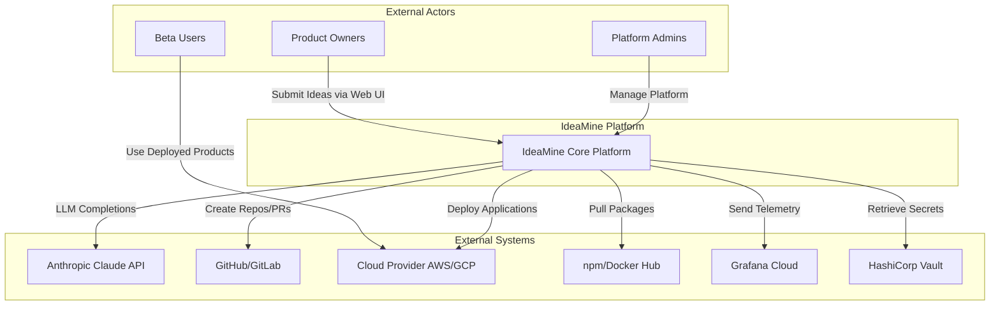
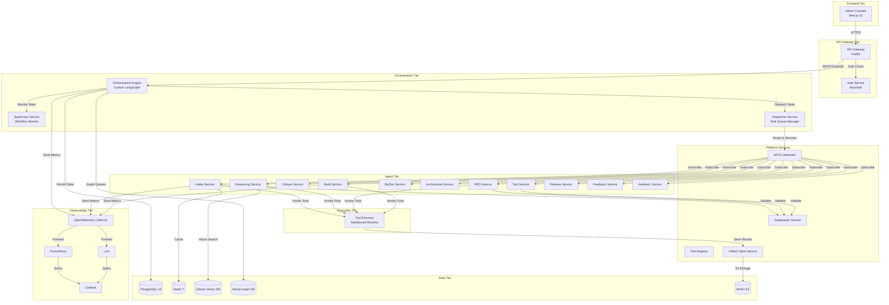
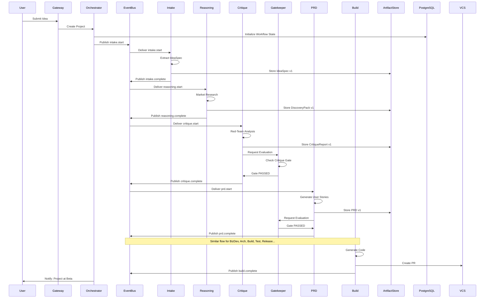
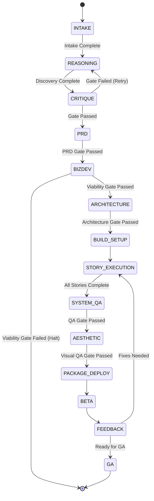
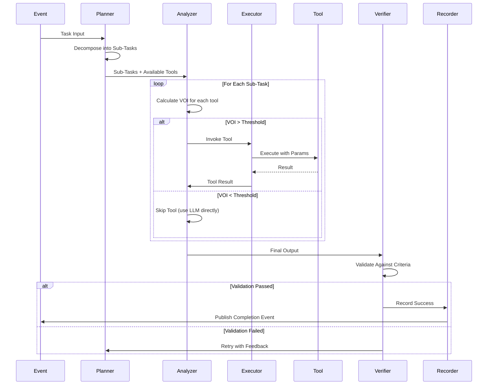
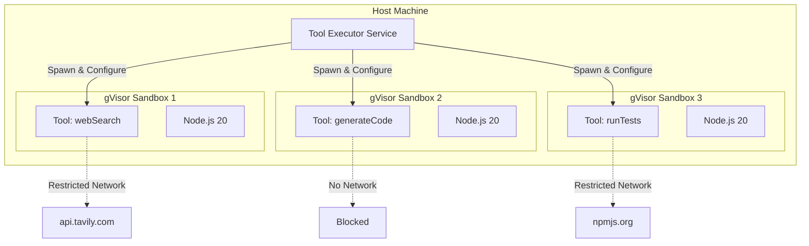
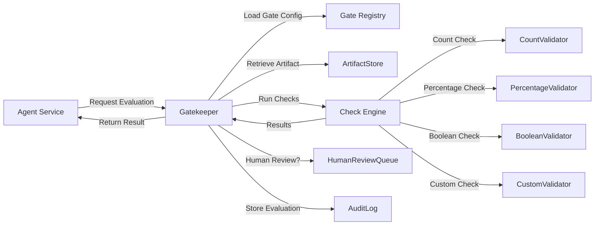
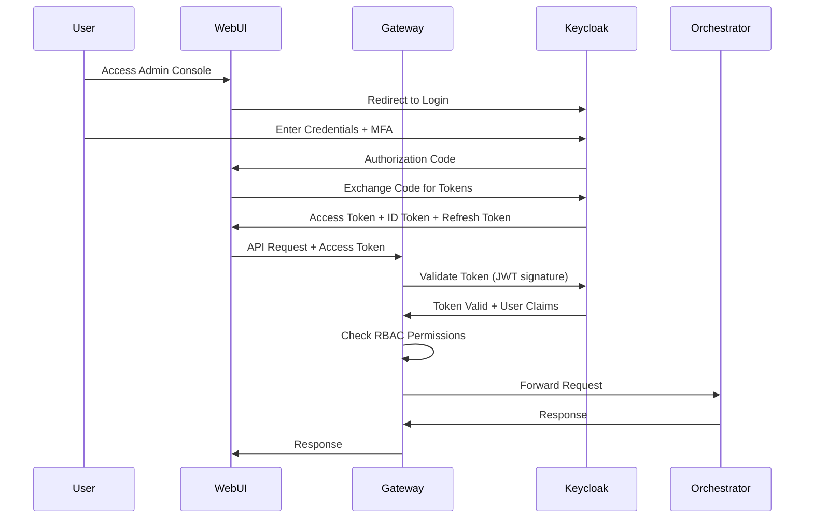

# IdeaMine System Architecture

**Version:** 1.0.0
**Date:** 2025-10-18
**Status:** Approved for Implementation
**Document Owner:** Engineering Leadership

---

## Table of Contents

1. [Executive Summary](#executive-summary)
2. [System Overview](#system-overview)
3. [Architecture Principles](#architecture-principles)
4. [High-Level Architecture](#high-level-architecture)
5. [Component Architecture](#component-architecture)
6. [Data Architecture](#data-architecture)
7. [API Architecture](#api-architecture)
8. [Security Architecture](#security-architecture)
9. [Deployment Architecture](#deployment-architecture)
10. [Observability Architecture](#observability-architecture)
11. [Architecture Decision Records (ADRs)](#architecture-decision-records-adrs)

---

## Executive Summary

IdeaMine's architecture is designed around three core principles: **modularity**, **observability**, and **resilience**. The system employs a **custom orchestration engine** built on LangGraph state machines, coordinating a **nine-layer "doer" hierarchy** that separates concerns between planning (Orchestrators), decision-making (Agents), and execution (Tools).

**Key Architectural Highlights:**

- **Event-Driven Microservices**: 13+ microservices communicating via NATS Jetstream
- **Custom Workflow Engine**: Durable state machines with checkpointing and replay
- **Analyzer-inside-Agent Pattern**: Intelligent tool usage optimization via VOI scoring
- **Sandboxed Execution**: gVisor containers for secure, isolated tool runs
- **Immutable Artifacts**: Content-addressed storage with SHA-256 hashing
- **Knowledge Graph**: Neo4j linking projects, artifacts, decisions, and metrics
- **Multi-Layer Quality Gates**: Automated gatekeepers enforcing standards at phase boundaries
- **Horizontal Scalability**: Kubernetes-based deployment with auto-scaling

**Technology Stack:**
- **Runtime**: Node.js 20 + TypeScript
- **Orchestration**: Custom engine (LangGraph + PostgreSQL)
- **Event Bus**: NATS Jetstream
- **Databases**: PostgreSQL 16 (primary), Redis 7 (cache), Qdrant (vector), Neo4j (knowledge graph)
- **Container Runtime**: Docker + gVisor (sandboxing)
- **Deployment**: Kubernetes 1.29+
- **Observability**: OpenTelemetry, Prometheus, Grafana, Loki

---

## System Overview

### System Context (C4 Level 1)



### Container Architecture (C4 Level 2)



### Data Flow: Idea → GA



---

## Architecture Principles

### 1. Separation of Concerns (Nine Doer Types)

**Principle:** Each doer type has a single, well-defined responsibility.

- **Orchestrators**: Workflow coordination and routing
- **Agents**: Decision-making and planning
- **Tools**: Atomic, reusable actions
- **Executors**: Sandboxed tool execution
- **Gatekeepers**: Quality enforcement
- **Triggers**: Event and schedule handling
- **Supervisors**: Workflow monitoring
- **Dispatchers**: Reliable message delivery
- **Recorders**: Audit and compliance logging

**Benefits:**
- Clear boundaries enable independent evolution
- Easier testing and debugging
- Reusability across phases

### 2. Event-Driven Communication

**Principle:** Services communicate asynchronously via events, not direct calls.

**Implementation:**
- NATS Jetstream for pub/sub messaging
- Event schemas versioned with JSON Schema
- At-least-once delivery guarantees
- Event sourcing for state reconstruction

**Benefits:**
- Loose coupling between services
- Natural parallelism (multiple agents process events concurrently)
- Resilience (services can fail and recover independently)
- Audit trail (all state changes captured as events)

### 3. Immutable Artifacts

**Principle:** All artifacts are versioned, content-addressed, and never mutated.

**Implementation:**
- SHA-256 content hashing
- S3-compatible storage (MinIO)
- Semantic versioning for artifact schemas
- Artifact URLs include hash for integrity verification

**Benefits:**
- Reproducibility (exact artifact retrieval)
- Cache-friendly (hash-based lookups)
- Compliance (tamper-proof audit trail)

### 4. Defense in Depth (Security)

**Principle:** Multiple security layers, assuming each can be breached.

**Layers:**
1. Network (TLS 1.3, private VPC, firewall rules)
2. Authentication (OAuth 2.1 + MFA)
3. Authorization (RBAC with least privilege)
4. Sandboxing (gVisor for tool execution)
5. Secrets (Vault with rotation)
6. Monitoring (anomaly detection, intrusion detection)

### 5. Observability by Design

**Principle:** Every component emits structured logs, metrics, and traces from day one.

**Implementation:**
- OpenTelemetry for instrumentation
- Structured JSON logs with correlation IDs
- RED metrics (Rate, Errors, Duration) for all services
- Distributed tracing across service boundaries

**Benefits:**
- Fast incident resolution
- Proactive issue detection
- Data-driven optimization

### 6. Cost-Aware Architecture

**Principle:** Design decisions optimize for cost efficiency without sacrificing quality.

**Strategies:**
- Analyzer pattern minimizes LLM API calls
- Response caching (7-day TTL)
- Tool result caching (24-hour TTL)
- Right-sized compute resources
- Reserved instances for predictable workloads

### 7. Fail Fast, Recover Gracefully

**Principle:** Detect failures quickly and recover automatically when possible.

**Mechanisms:**
- Circuit breakers for external dependencies
- Retry logic with exponential backoff
- Timeout enforcement at every layer
- Checkpointing for long-running workflows
- Dead-letter queues for unprocessable messages

---

## High-Level Architecture

### Layered Architecture

```
┌─────────────────────────────────────────────────────────────┐
│                    Presentation Layer                        │
│              (Admin Console, Web UI, APIs)                   │
└─────────────────────────────────────────────────────────────┘
                            ↓
┌─────────────────────────────────────────────────────────────┐
│                  Orchestration Layer                         │
│     (Lifecycle Orchestrator, Supervisors, Dispatchers)       │
└─────────────────────────────────────────────────────────────┘
                            ↓
┌─────────────────────────────────────────────────────────────┐
│                     Agent Layer                              │
│  (Intake, Reasoning, PRD, Build, Test, Release Agents...)    │
└─────────────────────────────────────────────────────────────┘
                            ↓
┌─────────────────────────────────────────────────────────────┐
│                     Tool Layer                               │
│      (Research, Analysis, Generation, Validation Tools)      │
└─────────────────────────────────────────────────────────────┘
                            ↓
┌─────────────────────────────────────────────────────────────┐
│                  Execution Layer                             │
│          (Sandboxed Executors, Tool Runtime)                 │
└─────────────────────────────────────────────────────────────┘
                            ↓
┌─────────────────────────────────────────────────────────────┐
│                    Platform Layer                            │
│  (Event Bus, Artifact Store, Tool Registry, Gatekeepers)     │
└─────────────────────────────────────────────────────────────┘
                            ↓
┌─────────────────────────────────────────────────────────────┐
│                      Data Layer                              │
│    (PostgreSQL, Redis, Qdrant, Neo4j, MinIO)                 │
└─────────────────────────────────────────────────────────────┘
```

### Request Flow

**Synchronous Flow (User-Initiated):**
```
User → API Gateway → Auth → Orchestrator → PostgreSQL (State) → Response
```

**Asynchronous Flow (Workflow Execution):**
```
Orchestrator → Event Bus → Agent Service → Tool Executor → Artifact Store
     ↑                                                              ↓
     └──────────────── Event Bus ← Agent Service ──────────────────┘
```

---

## Component Architecture

### 1. Orchestration Engine

**Responsibility:** Manage multi-phase workflows, coordinate agents, enforce gates.

**Core Concepts:**

**Workflow State Machine:**
```typescript
interface WorkflowState {
  projectId: string;
  currentPhase: Phase;
  phaseStates: Record<Phase, PhaseState>;
  globalContext: Record<string, unknown>;
  budget: BudgetState;
  checkpoints: Checkpoint[];
  createdAt: Date;
  updatedAt: Date;
}

type Phase =
  | 'INTAKE'
  | 'REASONING'
  | 'CRITIQUE'
  | 'PRD'
  | 'BIZDEV'
  | 'ARCHITECTURE'
  | 'BUILD_SETUP'
  | 'STORY_EXECUTION'
  | 'SYSTEM_QA'
  | 'AESTHETIC'
  | 'PACKAGE_DEPLOY'
  | 'BETA'
  | 'FEEDBACK'
  | 'GA';

interface PhaseState {
  status: 'PENDING' | 'IN_PROGRESS' | 'COMPLETED' | 'FAILED' | 'SKIPPED';
  startedAt?: Date;
  completedAt?: Date;
  artifacts: string[]; // artifact IDs
  gateEvaluation?: GateEvaluation;
  retryCount: number;
}
```

**State Transitions:**


**Orchestrator Implementation (Simplified):**
```typescript
// apps/orchestrator/src/core/lifecycle-orchestrator.ts
import { StateGraph } from '@langchain/langgraph';

export class LifecycleOrchestrator {
  private graph: StateGraph<WorkflowState>;

  constructor(
    private eventBus: EventBus,
    private stateStore: StateStore,
    private gatekeeper: Gatekeeper
  ) {
    this.graph = this.buildWorkflowGraph();
  }

  private buildWorkflowGraph(): StateGraph<WorkflowState> {
    const graph = new StateGraph<WorkflowState>({
      channels: {
        projectId: { value: (left, right) => right ?? left },
        currentPhase: { value: (left, right) => right ?? left },
        phaseStates: { value: (left, right) => ({ ...left, ...right }) },
        globalContext: { value: (left, right) => ({ ...left, ...right }) },
        budget: { value: (left, right) => right ?? left },
      },
    });

    // Define phase nodes
    graph.addNode('INTAKE', this.intakePhaseHandler.bind(this));
    graph.addNode('REASONING', this.reasoningPhaseHandler.bind(this));
    graph.addNode('CRITIQUE', this.critiquePhaseHandler.bind(this));
    graph.addNode('PRD', this.prdPhaseHandler.bind(this));
    // ... more nodes

    // Define edges (transitions)
    graph.addEdge('INTAKE', 'REASONING');
    graph.addEdge('REASONING', 'CRITIQUE');
    graph.addConditionalEdges('CRITIQUE', this.critiqueGateDecision.bind(this), {
      PASS: 'PRD',
      FAIL: 'REASONING', // retry
    });
    // ... more edges

    graph.setEntryPoint('INTAKE');
    graph.setFinishPoint('GA');

    return graph.compile({
      checkpointer: new PostgresCheckpointer(this.stateStore),
    });
  }

  private async intakePhaseHandler(state: WorkflowState): Promise<Partial<WorkflowState>> {
    // Publish intake.start event
    await this.eventBus.publish('intake.start', {
      projectId: state.projectId,
      context: state.globalContext,
    });

    // Wait for intake.complete event (or timeout)
    const result = await this.eventBus.waitForEvent(
      `intake.complete.${state.projectId}`,
      { timeout: 180000 } // 3 minutes
    );

    // Update state
    return {
      phaseStates: {
        ...state.phaseStates,
        INTAKE: {
          status: 'COMPLETED',
          completedAt: new Date(),
          artifacts: [result.ideaSpecId],
          retryCount: 0,
        },
      },
      currentPhase: 'REASONING',
    };
  }

  private async critiqueGateDecision(state: WorkflowState): Promise<'PASS' | 'FAIL'> {
    const critiqueArtifact = state.phaseStates.CRITIQUE.artifacts[0];
    const evaluation = await this.gatekeeper.evaluate('critique-gate', critiqueArtifact);

    if (evaluation.passed) {
      return 'PASS';
    } else if (state.phaseStates.CRITIQUE.retryCount < 3) {
      return 'FAIL'; // retry
    } else {
      throw new Error('Critique gate failed after 3 retries');
    }
  }

  async startWorkflow(ideaInput: IdeaInput): Promise<string> {
    const projectId = generateProjectId();

    const initialState: WorkflowState = {
      projectId,
      currentPhase: 'INTAKE',
      phaseStates: {},
      globalContext: { ideaInput },
      budget: { cap: 500, consumed: 0, breakdown: {} },
      checkpoints: [],
      createdAt: new Date(),
      updatedAt: new Date(),
    };

    await this.stateStore.save(projectId, initialState);

    // Run workflow (async)
    this.graph.invoke(initialState).catch((error) => {
      console.error(`Workflow failed for project ${projectId}:`, error);
      // Supervisor will detect and handle
    });

    return projectId;
  }

  async resumeWorkflow(projectId: string, fromCheckpoint?: string): Promise<void> {
    const state = await this.stateStore.load(projectId, fromCheckpoint);
    await this.graph.invoke(state);
  }
}
```

**Checkpointing:**
- Checkpoint saved after each phase completion
- Enables resume from last successful phase
- PostgreSQL storage with JSONB for state

**Timeouts and Retries:**
- Each phase has timeout (default: 30 minutes)
- Auto-retry on transient failures (max 3 attempts)
- Exponential backoff between retries
- Supervisor escalates if stuck

---

### 2. Agent Runtime (Analyzer-inside-Agent Pattern)

**Responsibility:** Execute agent logic with intelligent tool usage optimization.

**Agent Architecture:**
```
┌─────────────────────────────────────────────────────────────┐
│                         Agent                                │
│  ┌────────────┐  ┌──────────┐  ┌──────────┐  ┌──────────┐  │
│  │  Planner   │→ │ Analyzer │→ │ Executor │→ │ Verifier │  │
│  └────────────┘  └──────────┘  └──────────┘  └──────────┘  │
│                                                     ↓         │
│                                              ┌──────────┐    │
│                                              │ Recorder │    │
│                                              └──────────┘    │
└─────────────────────────────────────────────────────────────┘
```

**Agent Flow:**


**Value-of-Information (VOI) Calculation:**
```typescript
// packages/agent-sdk/src/analyzer.ts
interface ToolCandidate {
  toolId: string;
  params: Record<string, unknown>;
  estimatedQualityGain: number; // 0-1
  estimatedCost: number; // USD
  estimatedLatency: number; // ms
}

export class Analyzer {
  calculateVOI(candidate: ToolCandidate, context: AnalysisContext): number {
    const { estimatedQualityGain, estimatedCost, estimatedLatency } = candidate;
    const { confidenceWithoutTool, costSensitivity, latencySensitivity } = context;

    // Quality improvement factor (0-1)
    const qualityFactor = estimatedQualityGain * (1 - confidenceWithoutTool);

    // Cost penalty (normalized)
    const costPenalty = (estimatedCost / 10) * costSensitivity; // assume $10 = max cost

    // Latency penalty (normalized)
    const latencyPenalty = (estimatedLatency / 60000) * latencySensitivity; // 1 min = max latency

    // VOI = benefit - costs
    const voi = qualityFactor - costPenalty - latencyPenalty;

    return Math.max(0, Math.min(1, voi)); // clamp to 0-1
  }

  selectTools(
    candidates: ToolCandidate[],
    context: AnalysisContext,
    threshold: number
  ): ToolCandidate[] {
    return candidates
      .map((c) => ({ ...c, voi: this.calculateVOI(c, context) }))
      .filter((c) => c.voi >= threshold)
      .sort((a, b) => b.voi - a.voi); // highest VOI first
  }
}
```

**Agent SDK Interface:**
```typescript
// packages/agent-sdk/src/types.ts
export interface AgentConfig {
  id: string;
  version: string;
  phase: Phase;
  llm: LLMConfig;
  prompt: PromptConfig;
  tools: ToolsConfig;
  analyzer: AnalyzerConfig;
  verification: VerificationConfig;
}

export interface AgentContext {
  projectId: string;
  phaseInput: Record<string, unknown>;
  artifacts: Record<string, Artifact>;
  budget: BudgetState;
}

export interface AgentOutput {
  artifactId: string;
  artifact: unknown;
  metadata: {
    toolsInvoked: string[];
    tokenUsage: number;
    cost: number;
    duration: number;
  };
}

export abstract class BaseAgent {
  constructor(
    protected config: AgentConfig,
    protected llm: LLM,
    protected toolRegistry: ToolRegistry,
    protected artifactStore: ArtifactStore
  ) {}

  async execute(context: AgentContext): Promise<AgentOutput> {
    const startTime = Date.now();

    // Planner
    const plan = await this.plan(context);

    // Analyzer + Executor
    const executionResults = await this.analyzeAndExecute(plan, context);

    // Verifier
    const output = await this.verify(executionResults, context);

    // Recorder
    await this.record(context, output, Date.now() - startTime);

    return output;
  }

  protected abstract plan(context: AgentContext): Promise<Plan>;
  protected abstract analyzeAndExecute(plan: Plan, context: AgentContext): Promise<unknown>;
  protected abstract verify(result: unknown, context: AgentContext): Promise<AgentOutput>;
  protected abstract record(context: AgentContext, output: AgentOutput, duration: number): Promise<void>;
}
```

---

### 3. Tool Execution Architecture

**Responsibility:** Execute tools in sandboxed environments with security and observability.

**Executor Components:**
```
┌─────────────────────────────────────────────────────────────┐
│                      Tool Executor                           │
│                                                              │
│  ┌──────────────┐  ┌───────────────┐  ┌─────────────────┐  │
│  │   Validator  │→ │ Sandbox Mgr   │→ │ Result Handler  │  │
│  │ (Input/Tool) │  │ (gVisor/Docker)│  │ (Store/Return)  │  │
│  └──────────────┘  └───────────────┘  └─────────────────┘  │
│                                                              │
│  ┌──────────────────────────────────────────────────────┐   │
│  │              Security Controls                        │   │
│  │  • Network Policies (Allowlist)                      │   │
│  │  • Resource Limits (CPU, Memory, Disk)               │   │
│  │  • Timeout Enforcement                               │   │
│  │  • Secret Injection (from Vault)                     │   │
│  │  • Output Sanitization (Secret Redaction)            │   │
│  └──────────────────────────────────────────────────────┘   │
└─────────────────────────────────────────────────────────────┘
```

**Sandbox Isolation:**


**Tool Execution Flow:**
```typescript
// packages/tool-sdk/src/executor.ts
export class ToolExecutor {
  constructor(
    private sandboxManager: SandboxManager,
    private secretsManager: SecretsManager,
    private artifactStore: ArtifactStore
  ) {}

  async execute(request: ToolExecutionRequest): Promise<ToolExecutionResult> {
    const { toolId, version, params, context } = request;

    // 1. Validate input
    const tool = await this.toolRegistry.getTool(toolId, version);
    this.validateParams(params, tool.parameters);

    // 2. Prepare sandbox
    const sandbox = await this.sandboxManager.createSandbox({
      runtime: tool.execution.runtime,
      resources: tool.execution.sandbox.resources,
      network: tool.execution.sandbox.network,
      timeout: tool.execution.timeout,
    });

    // 3. Inject secrets
    const secrets = await this.secretsManager.getSecrets(tool.secrets);
    await sandbox.injectSecrets(secrets);

    // 4. Execute tool
    const startTime = Date.now();
    let result: ToolExecutionResult;

    try {
      const output = await sandbox.run(tool.execution.entrypoint, params, {
        timeout: tool.execution.timeout,
      });

      // 5. Validate output
      this.validateOutput(output, tool.returns);

      result = {
        success: true,
        output: this.sanitizeOutput(output), // redact secrets
        duration: Date.now() - startTime,
        cost: tool.cost.perInvocation,
      };
    } catch (error) {
      result = {
        success: false,
        error: error.message,
        duration: Date.now() - startTime,
        cost: tool.cost.perInvocation,
      };

      // Retry logic
      if (this.isRetryable(error) && request.retryCount < tool.execution.retries) {
        await this.delay(this.calculateBackoff(request.retryCount));
        return this.execute({ ...request, retryCount: request.retryCount + 1 });
      }
    } finally {
      // 6. Cleanup sandbox
      await sandbox.destroy();
    }

    // 7. Store result
    const resultId = await this.artifactStore.store({
      type: 'tool-result',
      toolId,
      version,
      params,
      result,
      context,
    });

    return { ...result, resultId };
  }

  private sanitizeOutput(output: unknown): unknown {
    // Redact patterns matching secrets (API keys, tokens, passwords)
    const sanitized = JSON.stringify(output);
    return JSON.parse(
      sanitized
        .replace(/sk-[a-zA-Z0-9]{48}/g, '[REDACTED_API_KEY]')
        .replace(/ghp_[a-zA-Z0-9]{36}/g, '[REDACTED_TOKEN]')
    );
  }
}
```

**Sandbox Manager (gVisor):**
```typescript
// packages/tool-sdk/src/sandbox-manager.ts
export class GVisorSandboxManager implements SandboxManager {
  async createSandbox(config: SandboxConfig): Promise<Sandbox> {
    const containerId = generateId();

    // Create gVisor container
    await exec(`docker run -d \
      --runtime=runsc \
      --name=${containerId} \
      --cpus=${config.resources.cpu} \
      --memory=${config.resources.memory} \
      --network=none \
      ${config.runtime} \
      tail -f /dev/null`);

    // Configure network if allowlist provided
    if (config.network?.allowlist?.length > 0) {
      await this.configureNetworkPolicy(containerId, config.network.allowlist);
    }

    return new GVisorSandbox(containerId, config);
  }

  private async configureNetworkPolicy(containerId: string, allowlist: string[]): Promise<void> {
    // Create custom Docker network with DNS filtering
    const networkId = `net-${containerId}`;
    await exec(`docker network create ${networkId}`);
    await exec(`docker network connect ${networkId} ${containerId}`);

    // Configure iptables for allowlist
    for (const domain of allowlist) {
      await exec(`docker exec ${containerId} iptables -A OUTPUT -d ${domain} -j ACCEPT`);
    }
    await exec(`docker exec ${containerId} iptables -A OUTPUT -j REJECT`);
  }
}

class GVisorSandbox implements Sandbox {
  constructor(private containerId: string, private config: SandboxConfig) {}

  async run(entrypoint: string, params: unknown, options: RunOptions): Promise<unknown> {
    const paramsFile = `/tmp/params-${Date.now()}.json`;
    await this.writeFile(paramsFile, JSON.stringify(params));

    const command = `node ${entrypoint} ${paramsFile}`;
    const result = await exec(`docker exec ${this.containerId} timeout ${options.timeout}ms ${command}`);

    return JSON.parse(result.stdout);
  }

  async injectSecrets(secrets: Record<string, string>): Promise<void> {
    for (const [key, value] of Object.entries(secrets)) {
      await exec(`docker exec ${this.containerId} sh -c 'export ${key}="${value}"'`);
    }
  }

  async destroy(): Promise<void> {
    await exec(`docker rm -f ${this.containerId}`);
  }
}
```

---

### 4. Gatekeeper Service

**Responsibility:** Enforce quality gates with configurable rubrics and evidence requirements.

**Gate Evaluation Architecture:**


**Gate Configuration Schema:**
```typescript
// packages/orchestrator-core/src/gatekeeper/types.ts
export interface GateConfig {
  id: string;
  name: string;
  phase: Phase;
  checks: Check[];
  humanReview: HumanReviewConfig;
  actions: GateActions;
}

export interface Check {
  id: string;
  name: string;
  type: 'count' | 'percentage' | 'boolean' | 'custom';
  required: boolean;
  threshold?: number;
  operator?: 'gt' | 'gte' | 'lt' | 'lte' | 'eq';
  extractor: string; // JSONPath expression
  customValidator?: string; // function name
}

export interface GateEvaluation {
  gateId: string;
  artifactId: string;
  passed: boolean;
  checkResults: CheckResult[];
  humanReviewRequired: boolean;
  evaluatedAt: Date;
  evaluatedBy: 'system' | 'human';
}
```

**Gatekeeper Implementation:**
```typescript
// services/gatekeeper/src/gatekeeper-service.ts
export class GatekeeperService {
  async evaluate(gateId: string, artifactId: string): Promise<GateEvaluation> {
    const gate = await this.gateRegistry.get(gateId);
    const artifact = await this.artifactStore.retrieve(artifactId);

    const checkResults = await Promise.all(
      gate.checks.map((check) => this.runCheck(check, artifact))
    );

    const requiredChecks = checkResults.filter((r) => r.required);
    const passed = requiredChecks.every((r) => r.passed);

    const humanReviewRequired = this.shouldEscalateToHuman(gate, checkResults);

    const evaluation: GateEvaluation = {
      gateId,
      artifactId,
      passed,
      checkResults,
      humanReviewRequired,
      evaluatedAt: new Date(),
      evaluatedBy: 'system',
    };

    // Store evaluation
    await this.auditLog.record('gate-evaluation', evaluation);

    // Escalate to human if needed
    if (humanReviewRequired) {
      await this.humanReviewQueue.enqueue({
        gateId,
        artifactId,
        evaluation,
      });
    }

    return evaluation;
  }

  private async runCheck(check: Check, artifact: unknown): Promise<CheckResult> {
    // Extract value using JSONPath
    const value = JSONPath({ path: check.extractor, json: artifact })[0];

    let passed = false;

    switch (check.type) {
      case 'count':
        passed = this.evaluateCount(value, check.threshold!, check.operator!);
        break;
      case 'percentage':
        passed = this.evaluatePercentage(value, check.threshold!);
        break;
      case 'boolean':
        passed = Boolean(value);
        break;
      case 'custom':
        passed = await this.evaluateCustom(check.customValidator!, value, artifact);
        break;
    }

    return {
      checkId: check.id,
      name: check.name,
      required: check.required,
      passed,
      value,
      threshold: check.threshold,
      message: this.getCheckMessage(check, passed, value),
    };
  }

  private evaluateCount(value: unknown, threshold: number, operator: string): boolean {
    const count = Array.isArray(value) ? value.length : Number(value);
    switch (operator) {
      case 'gt': return count > threshold;
      case 'gte': return count >= threshold;
      case 'lt': return count < threshold;
      case 'lte': return count <= threshold;
      case 'eq': return count === threshold;
      default: return false;
    }
  }

  private shouldEscalateToHuman(gate: GateConfig, results: CheckResult[]): boolean {
    if (!gate.humanReview.enabled) return false;

    // Check trigger conditions
    for (const trigger of gate.humanReview.triggers) {
      const triggerMet = this.evaluateTrigger(trigger, results);
      if (triggerMet) return true;
    }

    return false;
  }
}
```

**Example Gate Configurations:**
```yaml
# Critique Gate
gate:
  id: "critique-gate"
  name: "Critique Quality Gate"
  phase: "CRITIQUE"
  checks:
    - id: "min-risks"
      name: "Minimum Risk Identification"
      type: "count"
      required: true
      threshold: 15
      operator: "gte"
      extractor: "$.assumptions.length + $.technicalRisks.length + $.marketRisks.length"

    - id: "critical-findings"
      name: "Critical/High Severity Findings"
      type: "count"
      required: true
      threshold: 3
      operator: "gte"
      extractor: "$..[?(@.severity=='critical' || @.severity=='high')].length"

    - id: "assumption-coverage"
      name: "Assumption Confidence Rating Coverage"
      type: "percentage"
      required: true
      threshold: 100
      extractor: "$.assumptions[?(@.confidence)].length / $.assumptions.length * 100"

  humanReview:
    enabled: true
    triggers:
      - "$.recommendation == 'HALT'"
      - "$.viabilityScore < 50"

  actions:
    onPass: "advance_to_prd"
    onFail: "retry_critique"
    onHumanReviewRequired: "escalate_to_product_owner"
```

---

### 5. Event Bus Architecture (NATS Jetstream)

**Responsibility:** Reliable, ordered message delivery between services.

**Event Schema:**
```typescript
// packages/event-schemas/src/types.ts
export interface Event<T = unknown> {
  id: string; // UUID v7
  type: string; // e.g., "intake.complete"
  projectId: string;
  timestamp: string; // ISO 8601
  version: string; // event schema version
  payload: T;
  metadata: {
    source: string; // service that emitted event
    traceId: string; // distributed tracing
    correlationId: string; // request correlation
  };
}

// Event types
export type IntakeCompleteEvent = Event<{
  ideaSpecId: string;
  ideaSpec: IdeaSpec;
}>;

export type ReasoningCompleteEvent = Event<{
  discoveryPackId: string;
  discoveryPack: DiscoveryPack;
}>;

export type GateEvaluationEvent = Event<{
  gateId: string;
  artifactId: string;
  passed: boolean;
  humanReviewRequired: boolean;
}>;
```

**Event Bus Configuration:**
```typescript
// platform/event-bus/src/nats-event-bus.ts
import { connect, JetStreamClient, StreamConfig } from 'nats';

export class NATSEventBus implements EventBus {
  private jetstream: JetStreamClient;

  async connect(url: string): Promise<void> {
    const nc = await connect({ servers: url });
    this.jetstream = nc.jetstream();

    // Create streams for each domain
    await this.createStream({
      name: 'INTAKE',
      subjects: ['intake.*'],
      retention: 'limits',
      max_age: 7 * 24 * 60 * 60 * 1e9, // 7 days in nanoseconds
    });

    await this.createStream({
      name: 'REASONING',
      subjects: ['reasoning.*'],
      retention: 'limits',
      max_age: 7 * 24 * 60 * 60 * 1e9,
    });

    // ... more streams
  }

  async publish<T>(type: string, payload: T, projectId: string): Promise<void> {
    const event: Event<T> = {
      id: generateUUIDv7(),
      type,
      projectId,
      timestamp: new Date().toISOString(),
      version: '1.0.0',
      payload,
      metadata: {
        source: process.env.SERVICE_NAME!,
        traceId: getCurrentTraceId(),
        correlationId: getCurrentCorrelationId(),
      },
    };

    await this.jetstream.publish(type, JSON.stringify(event), {
      msgID: event.id, // deduplication
    });
  }

  async subscribe<T>(
    type: string,
    handler: (event: Event<T>) => Promise<void>,
    options?: SubscribeOptions
  ): Promise<void> {
    const subscription = await this.jetstream.subscribe(type, {
      durable_name: options?.durableName,
      deliver_policy: 'all',
      ack_policy: 'explicit',
      max_deliver: 5, // max redeliveries
    });

    for await (const msg of subscription) {
      try {
        const event: Event<T> = JSON.parse(msg.data.toString());
        await handler(event);
        msg.ack(); // acknowledge successful processing
      } catch (error) {
        console.error(`Error processing event ${msg.seq}:`, error);
        msg.nak(5000); // negative ack, redeliver after 5s
      }
    }
  }

  async waitForEvent(type: string, options: WaitOptions): Promise<unknown> {
    return new Promise((resolve, reject) => {
      const timeout = setTimeout(() => {
        reject(new Error(`Timeout waiting for event: ${type}`));
      }, options.timeout);

      this.subscribe(type, async (event) => {
        clearTimeout(timeout);
        resolve(event.payload);
      }, { durableName: `wait-${generateId()}` });
    });
  }
}
```

**Event Ordering Guarantees:**
- Per-project FIFO ordering (events for same projectId processed in order)
- Implemented via NATS Jetstream's ordered consumer
- Prevents race conditions (e.g., PRD starting before Critique completes)

---

## Data Architecture

### Database Schema (PostgreSQL)

**Workflow State Table:**
```sql
CREATE TABLE workflow_states (
  project_id UUID PRIMARY KEY,
  current_phase VARCHAR(50) NOT NULL,
  phase_states JSONB NOT NULL DEFAULT '{}',
  global_context JSONB NOT NULL DEFAULT '{}',
  budget JSONB NOT NULL,
  checkpoints JSONB[] DEFAULT ARRAY[]::JSONB[],
  created_at TIMESTAMPTZ NOT NULL DEFAULT NOW(),
  updated_at TIMESTAMPTZ NOT NULL DEFAULT NOW(),

  CHECK (current_phase IN ('INTAKE', 'REASONING', 'CRITIQUE', 'PRD', 'BIZDEV',
                           'ARCHITECTURE', 'BUILD_SETUP', 'STORY_EXECUTION',
                           'SYSTEM_QA', 'AESTHETIC', 'PACKAGE_DEPLOY', 'BETA',
                           'FEEDBACK', 'GA'))
);

CREATE INDEX idx_workflow_states_current_phase ON workflow_states(current_phase);
CREATE INDEX idx_workflow_states_updated_at ON workflow_states(updated_at);
```

**Artifact Metadata Table:**
```sql
CREATE TABLE artifacts (
  id UUID PRIMARY KEY DEFAULT gen_random_uuid(),
  project_id UUID NOT NULL REFERENCES workflow_states(project_id),
  type VARCHAR(50) NOT NULL,
  version VARCHAR(20) NOT NULL,
  content_hash VARCHAR(64) NOT NULL UNIQUE, -- SHA-256
  storage_url TEXT NOT NULL,
  size_bytes BIGINT NOT NULL,
  created_at TIMESTAMPTZ NOT NULL DEFAULT NOW(),
  created_by VARCHAR(100) NOT NULL,

  CHECK (type IN ('IdeaSpec', 'DiscoveryPack', 'CritiqueReport', 'PRD',
                  'BizDevPack', 'ArchPlan', 'BuildSetup', 'ReleaseBundle',
                  'BetaCohort', 'FeedbackItem', 'FixPR'))
);

CREATE INDEX idx_artifacts_project_id ON artifacts(project_id);
CREATE INDEX idx_artifacts_type ON artifacts(type);
CREATE INDEX idx_artifacts_content_hash ON artifacts(content_hash);
```

**Audit Log Table (TimescaleDB Hypertable):**
```sql
CREATE TABLE audit_logs (
  id UUID DEFAULT gen_random_uuid(),
  timestamp TIMESTAMPTZ NOT NULL DEFAULT NOW(),
  project_id UUID NOT NULL,
  phase VARCHAR(50),
  actor_type VARCHAR(20) NOT NULL,
  actor_id VARCHAR(100) NOT NULL,
  action VARCHAR(100) NOT NULL,
  inputs JSONB,
  outputs JSONB,
  metadata JSONB,
  trace_id VARCHAR(32),

  PRIMARY KEY (timestamp, id),
  CHECK (actor_type IN ('orchestrator', 'agent', 'tool', 'human', 'system'))
);

-- Convert to TimescaleDB hypertable for efficient time-series queries
SELECT create_hypertable('audit_logs', 'timestamp');

-- Retention policy: compress after 30 days, delete after 1 year
SELECT add_compression_policy('audit_logs', INTERVAL '30 days');
SELECT add_retention_policy('audit_logs', INTERVAL '1 year');
```

**Tool Registry Table:**
```sql
CREATE TABLE tools (
  id VARCHAR(100) NOT NULL,
  version VARCHAR(20) NOT NULL,
  name VARCHAR(200) NOT NULL,
  description TEXT,
  category VARCHAR(50) NOT NULL,
  config JSONB NOT NULL,
  approval_status VARCHAR(20) NOT NULL DEFAULT 'pending',
  approved_by VARCHAR(100),
  approved_at TIMESTAMPTZ,
  created_at TIMESTAMPTZ NOT NULL DEFAULT NOW(),
  updated_at TIMESTAMPTZ NOT NULL DEFAULT NOW(),

  PRIMARY KEY (id, version),
  CHECK (approval_status IN ('pending', 'approved', 'rejected', 'deprecated'))
);

CREATE INDEX idx_tools_category ON tools(category);
CREATE INDEX idx_tools_approval_status ON tools(approval_status);
```

**Budget Tracking Table:**
```sql
CREATE TABLE budget_tracking (
  id UUID PRIMARY KEY DEFAULT gen_random_uuid(),
  project_id UUID NOT NULL REFERENCES workflow_states(project_id),
  phase VARCHAR(50),
  actor_type VARCHAR(20) NOT NULL,
  actor_id VARCHAR(100) NOT NULL,
  item_type VARCHAR(50) NOT NULL, -- 'llm', 'tool', 'infrastructure'
  cost_usd DECIMAL(10, 4) NOT NULL,
  timestamp TIMESTAMPTZ NOT NULL DEFAULT NOW(),
  metadata JSONB
);

CREATE INDEX idx_budget_tracking_project_id ON budget_tracking(project_id);
CREATE INDEX idx_budget_tracking_timestamp ON budget_tracking(timestamp);

-- Materialized view for per-project budget summary
CREATE MATERIALIZED VIEW project_budgets AS
SELECT
  project_id,
  SUM(cost_usd) as total_cost,
  SUM(CASE WHEN item_type = 'llm' THEN cost_usd ELSE 0 END) as llm_cost,
  SUM(CASE WHEN item_type = 'tool' THEN cost_usd ELSE 0 END) as tool_cost,
  SUM(CASE WHEN item_type = 'infrastructure' THEN cost_usd ELSE 0 END) as infra_cost,
  MAX(timestamp) as last_updated
FROM budget_tracking
GROUP BY project_id;

CREATE UNIQUE INDEX idx_project_budgets_project_id ON project_budgets(project_id);
```

### Artifact Storage (MinIO S3)

**Bucket Structure:**
```
s3://ideamine-artifacts/
  {projectId}/
    ideaspec/
      {version}/
        {hash}.json
    discoverypack/
      {version}/
        {hash}.json
    critique/
      {version}/
        {hash}.json
    prd/
      {version}/
        {hash}.json
    ...
```

**Content Addressing:**
- Every artifact hashed with SHA-256
- URL format: `s3://ideamine-artifacts/{projectId}/{artifactType}/{version}/{hash}.json`
- Immutable: never overwrite existing artifacts
- Deduplication: identical content stored once, referenced multiple times

**Versioning:**
- Artifact schemas follow SemVer
- Backward compatibility maintained for minor/patch versions
- Breaking changes require major version bump
- Migration scripts for schema upgrades

### Vector Database (Qdrant)

**Collections:**

**1. Artifact Embeddings:**
```json
{
  "collection": "artifacts",
  "vectors": {
    "size": 1536,
    "distance": "Cosine"
  },
  "payload_schema": {
    "project_id": "keyword",
    "artifact_type": "keyword",
    "version": "keyword",
    "content_hash": "keyword",
    "created_at": "datetime",
    "text": "text"
  }
}
```

**2. Decision Embeddings (ADRs, Gate Evaluations):**
```json
{
  "collection": "decisions",
  "vectors": {
    "size": 1536,
    "distance": "Cosine"
  },
  "payload_schema": {
    "project_id": "keyword",
    "decision_type": "keyword",
    "phase": "keyword",
    "rationale": "text",
    "created_at": "datetime"
  }
}
```

**Use Cases:**
- RAG for agents (retrieve similar past projects)
- Semantic search across artifacts
- Find similar architectural decisions
- Duplicate idea detection

### Knowledge Graph (Neo4j)

**Node Types:**
- `Project`: Unique software projects
- `Artifact`: Versioned artifacts (IdeaSpec, PRD, etc.)
- `Decision`: ADRs, gate evaluations, tool selections
- `Metric`: Performance, cost, quality metrics
- `User`: Stakeholders, beta users
- `Tool`: Registered tools

**Relationship Types:**
- `(Project)-[:HAS_ARTIFACT]->(Artifact)`
- `(Artifact)-[:DEPENDS_ON]->(Artifact)`
- `(Decision)-[:AFFECTS]->(Artifact)`
- `(User)-[:PROVIDES]->(Feedback)`
- `(Phase)-[:GENERATES]->(Metric)`
- `(Agent)-[:USES]->(Tool)`
- `(Tool)-[:PRODUCES]->(Artifact)`

**Example Queries:**
```cypher
// Find all architectural decisions for a project
MATCH (p:Project {id: $projectId})-[:HAS_ARTIFACT]->(a:Artifact {type: 'ArchPlan'})-[:CONTAINS]->(d:Decision)
RETURN d.title, d.rationale, d.consequences

// Find projects with similar tech stack choices
MATCH (p1:Project {id: $projectId})-[:HAS_ARTIFACT]->(a1:Artifact {type: 'ArchPlan'})-[:CONTAINS]->(d1:Decision {category: 'techstack'})
MATCH (p2:Project)-[:HAS_ARTIFACT]->(a2:Artifact {type: 'ArchPlan'})-[:CONTAINS]->(d2:Decision {category: 'techstack'})
WHERE p1 <> p2 AND d1.decision = d2.decision
RETURN p2.id, COUNT(d2) as shared_decisions
ORDER BY shared_decisions DESC
LIMIT 10

// Find average time from Intake to PRD for similar complexity projects
MATCH (p:Project)-[:HAS_METRIC]->(m:Metric {type: 'phase_duration'})
WHERE m.phase = 'INTAKE' AND p.complexity = $complexity
RETURN AVG(m.duration_minutes) as avg_intake_duration
```

---

## API Architecture

### API Gateway (Fastify)

**Responsibilities:**
- Authentication and authorization
- Rate limiting
- Request routing
- Response caching
- API versioning
- Error handling

**Endpoints:**

**Project Management:**
```typescript
// POST /api/v1/projects - Submit new idea
// GET /api/v1/projects - List all projects
// GET /api/v1/projects/:projectId - Get project details
// GET /api/v1/projects/:projectId/status - Get workflow status
// POST /api/v1/projects/:projectId/resume - Resume failed workflow
```

**Artifacts:**
```typescript
// GET /api/v1/projects/:projectId/artifacts - List artifacts
// GET /api/v1/artifacts/:artifactId - Retrieve specific artifact
// GET /api/v1/artifacts/:artifactId/history - Get version history
```

**Metrics:**
```typescript
// GET /api/v1/projects/:projectId/metrics - Get project metrics
// GET /api/v1/metrics/platform - Get platform-wide metrics
```

**Admin:**
```typescript
// POST /api/v1/tools - Register new tool
// GET /api/v1/tools - List all tools
// PUT /api/v1/tools/:toolId/approve - Approve tool
// GET /api/v1/gates - List gate configurations
// PUT /api/v1/gates/:gateId - Update gate configuration
```

**GraphQL API (Alternative):**
```graphql
type Query {
  project(id: ID!): Project
  projects(filter: ProjectFilter, pagination: Pagination): ProjectConnection
  artifact(id: ID!): Artifact
  metrics(projectId: ID, timeRange: TimeRange): Metrics
}

type Mutation {
  submitIdea(input: IdeaInput!): Project!
  resumeWorkflow(projectId: ID!, fromCheckpoint: String): WorkflowState!
  approveGateEvaluation(gateId: ID!, artifactId: ID!): GateEvaluation!
}

type Subscription {
  workflowUpdated(projectId: ID!): WorkflowState!
  phaseCompleted(projectId: ID!): PhaseCompletion!
}
```

### Internal Service APIs (gRPC)

**Why gRPC:**
- High performance (binary protocol)
- Strong typing (Protobuf schemas)
- Bi-directional streaming
- Code generation for multiple languages

**Service Definitions:**

**Orchestrator Service:**
```protobuf
syntax = "proto3";

service OrchestratorService {
  rpc StartWorkflow(StartWorkflowRequest) returns (WorkflowState);
  rpc GetWorkflowState(GetWorkflowStateRequest) returns (WorkflowState);
  rpc ResumeWorkflow(ResumeWorkflowRequest) returns (WorkflowState);
  rpc CancelWorkflow(CancelWorkflowRequest) returns (Empty);
}

message StartWorkflowRequest {
  string project_id = 1;
  IdeaInput idea_input = 2;
  BudgetConfig budget = 3;
}

message WorkflowState {
  string project_id = 1;
  string current_phase = 2;
  map<string, PhaseState> phase_states = 3;
  map<string, string> global_context = 4;
  BudgetState budget = 5;
  repeated Checkpoint checkpoints = 6;
  int64 created_at = 7;
  int64 updated_at = 8;
}
```

**Agent Service:**
```protobuf
service AgentService {
  rpc ExecuteTask(ExecuteTaskRequest) returns (stream ExecuteTaskResponse);
  rpc GetTaskStatus(GetTaskStatusRequest) returns (TaskStatus);
  rpc CancelTask(CancelTaskRequest) returns (Empty);
}

message ExecuteTaskRequest {
  string project_id = 1;
  string phase = 2;
  map<string, string> context = 3;
  repeated string input_artifact_ids = 4;
}

message ExecuteTaskResponse {
  oneof response {
    Progress progress = 1;
    Completion completion = 2;
    Error error = 3;
  }
}
```

---

## Security Architecture

### Authentication & Authorization

**Authentication Flow (OAuth 2.1 + OIDC):**


**Role-Based Access Control (RBAC):**
```yaml
roles:
  - name: "admin"
    permissions:
      - "projects:*"
      - "tools:*"
      - "gates:*"
      - "users:*"

  - name: "product_owner"
    permissions:
      - "projects:create"
      - "projects:read"
      - "projects:update:own"
      - "artifacts:read"
      - "gates:review"

  - name: "developer"
    permissions:
      - "projects:read"
      - "artifacts:read"
      - "tools:create"
      - "tools:read"

  - name: "viewer"
    permissions:
      - "projects:read"
      - "artifacts:read"
      - "metrics:read"
```

### Secrets Management (HashiCorp Vault)

**Secrets Hierarchy:**
```
secret/
  ideamine/
    production/
      database/
        postgresql_url
        redis_url
      llm/
        anthropic_api_key
        openai_api_key
      cloud/
        aws_access_key_id
        aws_secret_access_key
      tools/
        tavily_api_key
        github_token
```

**Secret Rotation:**
- Automatic rotation every 90 days
- Zero-downtime rotation (dual-write during transition)
- Rotation alerts to ops team
- Audit trail for all secret access

**Secret Injection:**
- Environment variables for services (never hardcoded)
- Dynamic secrets for tool executors (short-lived, per-execution)
- Vault agent sidecar for Kubernetes pods

### Network Security

**Network Segmentation:**
```
┌─────────────────────────────────────────────────────────────┐
│                      Public Zone                            │
│  • API Gateway (HTTPS only, WAF enabled)                    │
│  • Admin Console (Static assets via CDN)                    │
└─────────────────────────────────────────────────────────────┘
                            ↓ (Firewall)
┌─────────────────────────────────────────────────────────────┐
│                   Application Zone                          │
│  • Orchestrator, Agent Services, Platform Services          │
│  • Private subnet, no public IPs                            │
└─────────────────────────────────────────────────────────────┘
                            ↓ (Firewall)
┌─────────────────────────────────────────────────────────────┐
│                      Data Zone                              │
│  • PostgreSQL, Redis, Qdrant, Neo4j, MinIO                  │
│  • Private subnet, no internet access                       │
└─────────────────────────────────────────────────────────────┘
                            ↓ (Firewall)
┌─────────────────────────────────────────────────────────────┐
│                    Execution Zone                           │
│  • Tool Executors (gVisor sandboxes)                        │
│  • Restricted network (allowlist only)                      │
└─────────────────────────────────────────────────────────────┘
```

**TLS Configuration:**
- TLS 1.3 minimum for all connections
- Certificate management via cert-manager (Kubernetes)
- Mutual TLS (mTLS) for service-to-service communication
- Certificate rotation every 90 days

### Data Protection

**Encryption at Rest:**
- PostgreSQL: Transparent Data Encryption (TDE)
- MinIO: Server-Side Encryption (SSE-KMS)
- Redis: Encryption via encrypted volumes
- Backups: Encrypted before upload to S3

**Encryption in Transit:**
- TLS 1.3 for all external connections
- mTLS for internal service-to-service
- gRPC with TLS for agent communication

**PII Handling:**
- PII inventory maintained in knowledge graph
- Tokenization for sensitive fields (emails, names)
- Redaction in logs and error messages
- Retention policies (GDPR right to be forgotten)

### Threat Model (STRIDE)

| Threat Type | Threat | Mitigation |
|-------------|--------|------------|
| **Spoofing** | Attacker impersonates legitimate user | OAuth + MFA, JWT validation, certificate pinning |
| **Tampering** | Attacker modifies artifact in storage | Content-addressed storage (SHA-256), immutable artifacts, audit logs |
| **Repudiation** | User denies performing action | Comprehensive audit logs, digital signatures for critical actions |
| **Information Disclosure** | Attacker exfiltrates sensitive data | Encryption at-rest/in-transit, network segmentation, sandbox isolation |
| **Denial of Service** | Attacker overwhelms system | Rate limiting, auto-scaling, circuit breakers, resource quotas |
| **Elevation of Privilege** | Attacker gains unauthorized access | RBAC with least privilege, regular permission audits, sandboxing |

---

## Deployment Architecture

### Kubernetes Architecture

**Cluster Layout:**
```
┌─────────────────────────────────────────────────────────────┐
│                    Kubernetes Cluster                        │
│                                                              │
│  ┌────────────────────────────────────────────────────┐     │
│  │              ideamine-api Namespace                 │     │
│  │  • API Gateway (3 replicas)                        │     │
│  │  • Auth Service (2 replicas)                       │     │
│  │  • Admin Console (3 replicas)                      │     │
│  └────────────────────────────────────────────────────┘     │
│                                                              │
│  ┌────────────────────────────────────────────────────┐     │
│  │           ideamine-orchestration Namespace          │     │
│  │  • Orchestrator (2 replicas)                       │     │
│  │  • Supervisor (2 replicas)                         │     │
│  │  • Dispatcher (3 replicas)                         │     │
│  └────────────────────────────────────────────────────┘     │
│                                                              │
│  ┌────────────────────────────────────────────────────┐     │
│  │            ideamine-agents Namespace                │     │
│  │  • Intake Service (2 replicas)                     │     │
│  │  • Reasoning Service (3 replicas)                  │     │
│  │  • PRD Service (3 replicas)                        │     │
│  │  • Build Service (5 replicas)                      │     │
│  │  • ... (all agent services)                        │     │
│  └────────────────────────────────────────────────────┘     │
│                                                              │
│  ┌────────────────────────────────────────────────────┐     │
│  │           ideamine-platform Namespace               │     │
│  │  • Gatekeeper (2 replicas)                         │     │
│  │  • Tool Registry (2 replicas)                      │     │
│  │  • Artifact Store Service (3 replicas)             │     │
│  │  • NATS Jetstream (3 replicas)                     │     │
│  └────────────────────────────────────────────────────┘     │
│                                                              │
│  ┌────────────────────────────────────────────────────┐     │
│  │             ideamine-data Namespace                 │     │
│  │  • PostgreSQL (StatefulSet, 3 replicas)            │     │
│  │  • Redis (StatefulSet, 3 replicas)                 │     │
│  │  • Qdrant (StatefulSet, 3 replicas)                │     │
│  │  • Neo4j (StatefulSet, 3 replicas)                 │     │
│  │  • MinIO (StatefulSet, 4 replicas)                 │     │
│  └────────────────────────────────────────────────────┘     │
│                                                              │
│  ┌────────────────────────────────────────────────────┐     │
│  │          ideamine-execution Namespace               │     │
│  │  • Tool Executor (10 replicas, auto-scale 5-50)    │     │
│  └────────────────────────────────────────────────────┘     │
└─────────────────────────────────────────────────────────────┘
```

**Auto-Scaling Configuration:**
```yaml
# HPA for Build Service
apiVersion: autoscaling/v2
kind: HorizontalPodAutoscaler
metadata:
  name: build-service-hpa
  namespace: ideamine-agents
spec:
  scaleTargetRef:
    apiVersion: apps/v1
    kind: Deployment
    name: build-service
  minReplicas: 3
  maxReplicas: 20
  metrics:
    - type: Resource
      resource:
        name: cpu
        target:
          type: Utilization
          averageUtilization: 70
    - type: Pods
      pods:
        metric:
          name: event_queue_depth
        target:
          type: AverageValue
          averageValue: "10"
```

### Multi-Region Deployment

**Active-Active Architecture:**
```
┌─────────────────┐       ┌─────────────────┐       ┌─────────────────┐
│   us-east-1     │       │   eu-west-1     │       │   ap-south-1    │
│                 │       │                 │       │                 │
│  • Full Stack   │       │  • Full Stack   │       │  • Full Stack   │
│  • Read/Write   │       │  • Read/Write   │       │  • Read/Write   │
│                 │       │                 │       │                 │
│  PostgreSQL ────┼───────┼─ PostgreSQL ────┼───────┼─ PostgreSQL     │
│  (Primary)      │       │  (Replica)      │       │  (Replica)      │
│                 │       │                 │       │                 │
│  MinIO ─────────┼───────┼─ MinIO ─────────┼───────┼─ MinIO          │
│  (Replicated)   │       │  (Replicated)   │       │  (Replicated)   │
└─────────────────┘       └─────────────────┘       └─────────────────┘
         │                         │                         │
         └─────────────────────────┴─────────────────────────┘
                       Global Load Balancer
                      (Route 53 or Cloudflare)
```

**Data Replication:**
- PostgreSQL: Streaming replication (primary → replicas)
- MinIO: Active-active bucket replication
- Redis: Redis Cluster with multi-region
- NATS: Clustered across regions with leaf nodes

---

## Observability Architecture

### Metrics (Prometheus)

**Service-Level Metrics:**
```yaml
# RED Metrics (Rate, Errors, Duration)
- http_requests_total{service, endpoint, method, status}
- http_request_duration_seconds{service, endpoint, method}
- http_errors_total{service, endpoint, method, error_type}

# Business Metrics
- ideamine_projects_created_total
- ideamine_projects_completed_total{phase}
- ideamine_gate_evaluations_total{gate, passed}
- ideamine_llm_requests_total{model, agent}
- ideamine_llm_cost_usd{model, agent}
- ideamine_tool_executions_total{tool, success}

# Infrastructure Metrics
- container_cpu_usage_seconds_total
- container_memory_usage_bytes
- postgres_connections_active
- redis_connected_clients
- nats_msg_rate
```

**Dashboards (Grafana):**
1. **Platform Overview**: Projects in-flight, completion rate, uptime, error rate
2. **Cost Dashboard**: LLM costs, infrastructure costs, per-project costs
3. **Performance Dashboard**: Latency p50/p95/p99, throughput, queue depth
4. **Agent Dashboard**: Agent invocations, tool usage, VOI scores, success rate
5. **Infrastructure Dashboard**: CPU, memory, disk, network per service

### Logging (Loki)

**Structured Logging Format:**
```json
{
  "timestamp": "2025-10-18T10:30:45.123Z",
  "level": "info",
  "service": "prd-service",
  "traceId": "abc123",
  "correlationId": "xyz789",
  "projectId": "proj-001",
  "message": "User stories generated successfully",
  "storyCount": 67,
  "duration": 18234
}
```

**Log Queries:**
```logql
# Find all errors in last hour
{service="orchestrator"} |= "level=error" | json

# Track specific project
{projectId="proj-001"} | json

# Find slow requests (>30s)
{service=~".*-service"} | json | duration > 30000

# Find budget overruns
{service="budget-guard"} |= "threshold_exceeded" | json
```

### Tracing (OpenTelemetry + Jaeger)

**Trace Structure:**
```
Request: Submit Idea
├─ Span: API Gateway (1.2s)
│  └─ Span: Authenticate (0.3s)
├─ Span: Orchestrator.StartWorkflow (45s)
│  ├─ Span: Save Initial State (0.5s)
│  └─ Span: Publish intake.start Event (0.1s)
├─ Span: Intake Service (35s)
│  ├─ Span: LLM: Extract IdeaSpec (18s)
│  ├─ Span: Tool: validateConstraints (2s)
│  ├─ Span: Tool: estimateComplexity (3s)
│  └─ Span: Store IdeaSpec Artifact (1s)
└─ Span: Return Response (0.1s)
```

**Trace Sampling:**
- 100% for errors
- 100% for requests >30s
- 10% for successful requests
- Custom sampling for expensive operations

### Alerts (Prometheus Alertmanager)

**Critical Alerts:**
```yaml
groups:
  - name: ideamine-critical
    interval: 30s
    rules:
      - alert: HighErrorRate
        expr: rate(http_errors_total[5m]) > 0.05
        for: 2m
        labels:
          severity: critical
        annotations:
          summary: "High error rate detected"
          description: "{{ $labels.service }} has error rate {{ $value }} (>5%)"

      - alert: SystemDown
        expr: up{job=~".*-service"} == 0
        for: 1m
        labels:
          severity: critical
        annotations:
          summary: "Service is down"

      - alert: DatabaseConnectionsFull
        expr: postgres_connections_active / postgres_connections_max > 0.9
        for: 5m
        labels:
          severity: critical
```

**Warning Alerts:**
```yaml
      - alert: BudgetThresholdExceeded
        expr: ideamine_project_budget_consumed / ideamine_project_budget_cap > 0.8
        labels:
          severity: warning
        annotations:
          summary: "Project budget at 80%"

      - alert: SlowPhaseExecution
        expr: ideamine_phase_duration_seconds > 1800
        labels:
          severity: warning
        annotations:
          summary: "Phase taking >30 minutes"
```

---

## Architecture Decision Records (ADRs)

### ADR-001: Custom Orchestration Engine vs. Temporal/Airflow

**Context:**
Need workflow orchestration with:
- Durable state machines
- Event-driven transitions
- Checkpointing and replay
- LLM-native primitives

**Options:**
1. **Temporal**: Mature, durable, excellent developer experience
2. **Apache Airflow**: Widely adopted, Python ecosystem
3. **Custom (LangGraph + PostgreSQL)**: Full control, LLM-optimized

**Decision:** Custom orchestration engine built on LangGraph

**Rationale:**
- LangGraph provides LLM-native state machine primitives
- Temporal/Airflow over-engineered for our specific use case
- Custom solution allows tight integration with agent SDK
- Lower operational complexity than running Temporal cluster
- PostgreSQL checkpointing simpler than Temporal's Cassandra/MySQL

**Consequences:**
- **Positive**: Full control over workflow semantics, optimized for LLM agents, simpler ops
- **Negative**: Need to build supervisor/monitoring ourselves, less battle-tested

**Status:** Accepted

---

### ADR-002: NATS Jetstream vs. Kafka for Event Bus

**Context:**
Need event bus with:
- At-least-once delivery
- Ordering guarantees per project
- Persistence for replay
- Low operational overhead

**Options:**
1. **NATS Jetstream**: Lightweight, Go-based, built-in persistence
2. **Apache Kafka**: Industry standard, mature ecosystem
3. **RabbitMQ**: Message broker with queues

**Decision:** NATS Jetstream

**Rationale:**
- Simpler operational model than Kafka (no Zookeeper/KRaft)
- Built-in persistence (Jetstream) vs. NATS Core
- Lower resource footprint (important for cost)
- Ordering via ordered consumer
- Excellent Kubernetes integration

**Consequences:**
- **Positive**: Easier to operate, lower costs, faster throughput
- **Negative**: Smaller ecosystem than Kafka, fewer integrations

**Status:** Accepted

---

### ADR-003: gVisor for Sandboxing vs. Docker-in-Docker

**Context:**
Tool execution requires:
- Strong isolation (prevent escapes)
- Resource limits
- Network controls
- Fast startup times

**Options:**
1. **gVisor**: User-space kernel, strong isolation
2. **Docker-in-Docker (DinD)**: Nested containers
3. **Firecracker**: Lightweight VMs

**Decision:** gVisor

**Rationale:**
- Stronger isolation than DinD (separate kernel)
- Faster startup than Firecracker VMs
- Compatible with standard Docker images
- Resource overhead acceptable (<10%)
- Network filtering via iptables integration

**Consequences:**
- **Positive**: Strong security, fast startup, Docker compatibility
- **Negative**: Some syscalls unsupported (rarely an issue), 10% performance overhead

**Status:** Accepted

---

### ADR-004: PostgreSQL vs. MongoDB for Workflow State

**Context:**
Workflow state storage requires:
- ACID transactions
- JSONB support for flexible state
- Strong consistency
- Relational queries for audit logs

**Options:**
1. **PostgreSQL**: Relational with JSONB
2. **MongoDB**: Document database
3. **DynamoDB**: Managed NoSQL

**Decision:** PostgreSQL

**Rationale:**
- ACID guarantees critical for workflow state
- JSONB provides flexibility for dynamic state
- Mature replication and backup tooling
- Team expertise with PostgreSQL
- TimescaleDB extension for time-series audit logs

**Consequences:**
- **Positive**: Strong consistency, mature tooling, JSONB flexibility
- **Negative**: Vertical scaling limits (mitigated by read replicas)

**Status:** Accepted

---

### ADR-005: Qdrant vs. Pinecone for Vector Database

**Context:**
Need vector database for:
- Artifact embeddings (RAG)
- Semantic search
- Hybrid search (vector + filters)
- Self-hosted option

**Options:**
1. **Qdrant**: Open-source, Rust-based, hybrid search
2. **Pinecone**: Managed, serverless, easy to use
3. **Weaviate**: Open-source, Go-based

**Decision:** Qdrant

**Rationale:**
- Open-source with self-hosting option (no vendor lock-in)
- Excellent hybrid search (vector + filter)
- Rust performance and safety
- Active development and community
- Lower cost than Pinecone at scale

**Consequences:**
- **Positive**: No vendor lock-in, lower costs, hybrid search
- **Negative**: Need to manage infrastructure (mitigated by Kubernetes)

**Status:** Accepted

---

**End of Architecture Document**

---

*This architecture is designed for production scale. All components are horizontally scalable, observable, and secure by design.*

**Revision History:**
- v1.0.0 (2025-10-18): Initial architecture document
