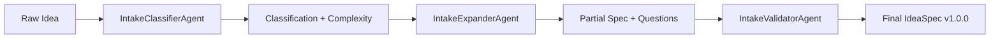

# IdeaMine Agents

This document describes the agent implementations in the `@ideamine/agents` package. All agents follow the **Analyzer-inside-Agent** pattern with VOI (Value-of-Information) scoring for tool invocation optimization.

## Architecture

### Analyzer-inside-Agent Pattern

Each agent follows a five-step internal execution pattern:

```
1. PLANNER     → Creates execution plan
2. REASONING   → Initial attempt without tools
3. ANALYZER    → Evaluates if tools would improve output (VOI scoring)
4. EXECUTOR    → Invokes tools if VOI > threshold
5. VERIFIER    → Validates improvement, may retry
```

### VOI Scoring

Tools are invoked only when their expected value exceeds the cost:

```
VOI = (expected_error_reduction × utility_weight) - (cost + latency_penalty + risk_penalty)
```

Agents will use tools when:
- `VOI score > voiThreshold` (configured per agent)
- `confidence < confidenceThreshold` (agent-specific)
- Tool is in the `allowlist` (security constraint)

## Phase 1: INTAKE Agents

The Intake phase consists of three agents that run sequentially to transform a raw idea into a validated IdeaSpec artifact.

### 1. IntakeClassifierAgent

**Purpose:** Categorize ideas and estimate project complexity

**Configuration:** `src/config/intake-agents.yaml` (id: `intake-classifier-agent`)

**Input:**
```typescript
{
  ideaText: string;       // Raw idea description (min 50 chars)
  title?: string;         // Optional idea title
  targetUsers?: string[]; // Optional user groups
}
```

**Output Artifact:**
```typescript
{
  type: 'intake-classification',
  version: '1.0.0',
  content: {
    category: 'technical' | 'business' | 'creative' | 'hybrid';
    subcategories: string[];  // e.g., ['web-app', 'api', 'b2b-saas']
    complexity: 'low' | 'medium' | 'high';
    estimatedAgents: string[]; // IDs of downstream agents needed
    confidence: number;        // 0.0-1.0
    reasoning: string;
    complexityIndicators?: {
      featureCount: number;
      integrationCount: number;
      dataVolume: 'low' | 'medium' | 'high';
      userScale: 'low' | 'medium' | 'high';
      technicalComplexity: 'low' | 'medium' | 'high';
    };
    similarProjectsFound?: number;
  }
}
```

**Tools Available:**
- `estimate-complexity`: Uses Claude to analyze idea text and estimate project complexity
- `search-similar-ideas`: Searches Qdrant vector DB for similar past projects

**Behavior:**
1. Analyzes idea text using Claude Sonnet (temperature 0.3)
2. Classifies into primary category (technical/business/creative/hybrid)
3. Identifies subcategories (e.g., "web-app", "b2b-saas", "ml-model")
4. If `confidence < 0.8`, invokes `estimate-complexity` tool for detailed analysis
5. If `confidence < 0.7`, invokes `search-similar-ideas` to find comparable projects
6. Determines which downstream agents will be needed based on category

**Example Categories:**
- **Technical:** APIs, SDKs, developer tools, infrastructure, ML models
- **Business:** SaaS, marketplaces, CRM, analytics dashboards, fintech
- **Creative:** Content tools, social media, design platforms, gaming
- **Hybrid:** Ideas spanning multiple categories

**Fallback:** If Claude LLM is unavailable, uses keyword-based heuristic classification.

---

### 2. IntakeExpanderAgent

**Purpose:** Generate clarifying questions and extract structured information from the idea

**Configuration:** `src/config/intake-agents.yaml` (id: `intake-expander-agent`)

**Input:**
```typescript
{
  ideaText: string;
  title?: string;
  classification?: object;  // Output from IntakeClassifierAgent
}
```

**Output Artifact:**
```typescript
{
  type: 'intake-expansion',
  version: '1.0.0',
  content: {
    partialSpec: {
      version: '1.0.0',
      title?: string;
      description?: string;
      targetUsers?: string[];
      problemStatement?: string;
      successCriteria?: string[];
      constraints?: {
        budget?: { min: number; max: number; currency: 'USD' };
        timeline?: { min: number; max: number; unit: 'days' };
        technicalPreferences?: string[];
        complianceRequirements?: string[];
      };
    };
    questions: Array<{
      id: string;
      question: string;
      category: 'users' | 'problem' | 'solution' | 'constraints' | 'success';
      priority: 'high' | 'medium' | 'low';
      optional: boolean;
    }>;
    extractionConfidence: number;
    missingFields: string[];
  }
}
```

**Tools Available:**
- `validate-constraints`: Validates budget, timeline, and compliance requirements

**Behavior:**
1. Extracts structured information from idea text using Claude (temperature 0.4)
2. Identifies missing or unclear information
3. Generates 5-10 clarifying questions focused on missing fields:
   - **High priority:** Critical for understanding (users, problem, core solution)
   - **Medium priority:** Important but inferable (metrics, constraints)
   - **Low priority:** Nice to have (edge cases, future features)
4. If constraints are mentioned, invokes `validate-constraints` tool
5. Creates a partial IdeaSpec with extracted information

**Question Categories:**
- `users`: Who are the users? What are their roles?
- `problem`: What problem are we solving? Why does it matter?
- `solution`: How should this work? What features are essential?
- `constraints`: Budget, timeline, tech stack, compliance?
- `success`: How do we measure success? What are the KPIs?

**Fallback:** If Claude is unavailable, uses simple extraction heuristics and generates default questions.

---

### 3. IntakeValidatorAgent

**Purpose:** Validate completeness and generate the final IdeaSpec artifact

**Configuration:** `src/config/intake-agents.yaml` (id: `intake-validator-agent`)

**Input:**
```typescript
{
  partialSpec: Partial<IdeaSpec>;  // Output from IntakeExpanderAgent
}
```

**Output Artifacts:**

1. **idea-spec** (primary):
```typescript
{
  type: 'idea-spec',
  version: '1.0.0',
  content: {
    version: '1.0.0',
    projectId: string;        // UUID v7
    submittedBy: string;
    submittedAt: string;      // ISO 8601
    title: string;            // 5-200 chars
    description: string;      // 100-5000 chars
    targetUsers: string[];    // Min 1
    problemStatement: string; // 50-2000 chars
    successCriteria: string[]; // Min 1
    constraints: {
      budget: { min: number; max: number; currency: 'USD' };
      timeline: { min: number; max: number; unit: 'days' };
      technicalPreferences: string[];
      complianceRequirements: string[];
    };
    attachments: Array<{ type: string; url: string; description?: string }>;
    metadata: {
      tags: string[];
      priority: 'low' | 'medium' | 'high';
      customFields: Record<string, any>;
      source: 'intake-phase';
      validatedAt: string;
      validationConfidence: number;
      appliedDefaults: string[];
    };
  }
}
```

2. **intake-validation** (diagnostic):
```typescript
{
  type: 'intake-validation',
  version: '1.0.0',
  content: {
    validation: {
      isValid: boolean;
      issues: Array<{
        field: string;
        severity: 'error' | 'warning' | 'info';
        message: string;
        suggestion?: string;
      }>;
      completeness: number; // 0.0-1.0
    };
    appliedDefaults: string[];
  }
}
```

**Tools Available:**
- `validate-constraints`: Final validation of budget and timeline constraints

**Behavior:**
1. Validates partial IdeaSpec completeness (temperature 0.2 for strict validation)
2. Checks all required fields are present and meaningful
3. Applies sensible defaults for missing optional fields:
   - **projectId:** Generates UUID v7
   - **title:** "Untitled Project" if missing
   - **budget:** $100-$500 USD default
   - **timeline:** 7-14 days default
   - **targetUsers:** ["general users"] if missing
   - **problemStatement:** Generic fallback
   - **successCriteria:** Default metrics
4. Performs final validation with Claude LLM
5. Generates two artifacts: validated IdeaSpec + validation report
6. Enriches metadata with validation info

**Validation Checks:**
- **Completeness:** All required fields present
- **Consistency:** Fields align with each other
- **Quality:** Information detailed enough to proceed
- **Feasibility:** Constraints (budget, timeline) realistic

**Fallback:** If Claude unavailable, uses permissive validation and applies all defaults.

---

## Agent Flow

### Complete Intake Pipeline



### Orchestrator Integration

The `LangGraphOrchestrator` (`@ideamine/orchestrator-core`) executes the intake phase:

```typescript
// From langgraph-orchestrator.ts:249
private async executeIntakePhase(state: GraphState): Promise<Partial<GraphState>> {
  // 1. Load agent configurations
  const configs = loadIntakeAgentConfigs();

  // 2. Initialize agents
  const classifier = new IntakeClassifierAgent(configs[0]);
  const expander = new IntakeExpanderAgent(configs[1]);
  const validator = new IntakeValidatorAgent(configs[2]);

  // 3. Execute sequentially
  const classifierOutput = await classifier.execute({ data: { ideaText, title }, ... });
  const expanderOutput = await expander.execute({ data: { ideaText, classification }, ... });
  const validatorOutput = await validator.execute({ data: { partialSpec }, ... });

  // 4. Store artifacts and publish events
  state.workflowRun.ideaSpec = validatorOutput.ideaSpec;
  await eventPublisher.publishPhaseCompleted('INTAKE', ...);

  return state;
}
```

---

## Configuration

### Agent Configuration YAML

Location: `packages/agents/src/config/intake-agents.yaml`

```yaml
agents:
  - id: "intake-classifier-agent"
    llm:
      provider: "anthropic"
      model: "claude-3-7-sonnet-20250219"
      temperature: 0.3     # Balanced for classification
      maxTokens: 8000
    toolPolicy:
      maxToolInvocations: 2
      maxCostUsd: 0.50
      voiThreshold: 0.5    # Moderate threshold
      confidenceThreshold: 0.7
      allowlist:
        - "estimate-complexity"
        - "search-similar-ideas"
    budget:
      maxTokens: 8000
      maxCostUsd: 0.50
    timeout: 30000

  - id: "intake-expander-agent"
    llm:
      temperature: 0.4     # More creative for questions
      maxTokens: 8000
    toolPolicy:
      maxCostUsd: 0.25
      voiThreshold: 0.6
      allowlist:
        - "validate-constraints"
    timeout: 40000

  - id: "intake-validator-agent"
    llm:
      temperature: 0.2     # Low for strict validation
      maxTokens: 4000
    toolPolicy:
      maxCostUsd: 0.15
      voiThreshold: 0.7
      confidenceThreshold: 0.85  # High for final validation
      allowlist:
        - "validate-constraints"
    timeout: 20000
```

### Loading Configurations

```typescript
import { loadIntakeAgentConfigs } from '@ideamine/agents';

const configs = loadIntakeAgentConfigs();
// Returns: Array<AgentConfig> for all 3 intake agents
```

---

## Testing

### Unit Tests

Location: `packages/agents/tests/intake/`

```bash
# Run all tests
pnpm test

# Run specific agent tests
pnpm test classifier-agent.test.ts
pnpm test expander-agent.test.ts
pnpm test validator-agent.test.ts

# Run with coverage
pnpm test --coverage
```

### Integration Tests

Location: `packages/agents/tests/integration/intake-flow.test.ts`

Tests the complete intake pipeline end-to-end:

```typescript
describe('Complete Intake Pipeline', () => {
  it('should process a complete idea through all three agents', async () => {
    const classifierOutput = await classifierAgent.execute(input);
    const expanderOutput = await expanderAgent.execute({
      data: { ideaText, classification }
    });
    const validatorOutput = await validatorAgent.execute({
      data: { partialSpec: expansion.partialSpec }
    });

    // Validate final IdeaSpec with Zod schema
    expect(IdeaSpecSchema.safeParse(validatorOutput.ideaSpec).success).toBe(true);
  });
});
```

### Coverage Thresholds

- **Branches:** 70%
- **Functions:** 75%
- **Lines:** 80%
- **Statements:** 80%

---

## Usage Examples

### Example 1: Technical API Idea

**Input:**
```typescript
{
  ideaText: `
    Build a REST API for managing user authentication and authorization.
    Support OAuth 2.0, JWT tokens, and role-based access control.
    Integrate with existing databases and provide endpoints for
    login, logout, password reset, and user management.
  `,
  title: 'Authentication API'
}
```

**Classifier Output:**
```typescript
{
  category: 'technical',
  subcategories: ['api', 'web-app'],
  complexity: 'medium',
  confidence: 0.89
}
```

**Expander Output:**
```typescript
{
  partialSpec: {
    title: 'Authentication API',
    description: '...',
    targetUsers: ['developers', 'backend engineers'],
    problemStatement: 'Need secure auth system...',
  },
  questions: [
    { question: 'What database systems should we support?', category: 'solution', ... },
    { question: 'What is the expected user scale?', category: 'constraints', ... }
  ]
}
```

**Validator Output:**
```typescript
{
  ideaSpec: {
    version: '1.0.0',
    projectId: '01234567-89ab-7def-0123-456789abcdef',
    title: 'Authentication API',
    constraints: {
      budget: { min: 1000, max: 2000, currency: 'USD' },  // Applied default
      timeline: { min: 14, max: 21, unit: 'days' }
    },
    // ... all other required fields
  }
}
```

---

### Example 2: Business SaaS Idea

**Input:**
```typescript
{
  ideaText: `
    Launch a subscription-based CRM for small businesses.
    Pricing: $29/mo basic, $79/mo pro.
    Target: 5-50 employee companies in retail and hospitality.
    Revenue goal: $50K MRR in 12 months.
  `
}
```

**Classifier Output:**
```typescript
{
  category: 'business',
  subcategories: ['b2b-saas', 'crm'],
  complexity: 'high',
  confidence: 0.92
}
```

---

### Example 3: Minimal Idea with Defaults

**Input:**
```typescript
{
  ideaText: 'Build a simple todo list app'
}
```

**Validator Applied Defaults:**
```typescript
{
  appliedDefaults: [
    'projectId',
    'submittedAt',
    'submittedBy',
    'targetUsers',
    'problemStatement',
    'successCriteria',
    'constraints.budget',
    'constraints.timeline'
  ]
}
```

---

## Error Handling

### LLM Failures

All agents have fallback mechanisms:

- **Classifier:** Keyword-based heuristic classification
- **Expander:** Default question set (5 generic questions)
- **Validator:** Permissive validation with all defaults applied

### Tool Failures

When tools fail:
1. Agent logs warning
2. Continues with reasoning-only result
3. Confidence score reduced
4. Fallback values used

### Retry Logic

From `BaseAgent` (agent-sdk):
- **maxAttempts:** 3 (configurable)
- **Backoff:** Exponential (configurable)
- **Retryable errors:** Timeout, rate limit, network
- **Non-retryable:** Invalid input, authentication failure

---

## Performance

### Expected Costs (per agent)

| Agent | Avg Tokens | Avg Cost | Max Cost |
|-------|-----------|----------|----------|
| Classifier | ~4,000 | $0.08 | $0.50 |
| Expander | ~6,000 | $0.12 | $0.25 |
| Validator | ~2,000 | $0.04 | $0.15 |
| **Total** | **~12,000** | **$0.24** | **$0.90** |

### Expected Latency

| Agent | Typical | P95 | Timeout |
|-------|---------|-----|---------|
| Classifier | 3-5s | 8s | 30s |
| Expander | 5-8s | 12s | 40s |
| Validator | 2-4s | 6s | 20s |
| **Total** | **10-17s** | **26s** | **90s** |

### Optimization

- **Parallel Tool Invocation:** When multiple tools have high VOI, execute in parallel
- **Caching:** Similar ideas cached in Redis (TTL: 1 hour)
- **Batching:** Process multiple ideas in batch for better throughput

---

## Observability

### Metrics Tracked

- **Agent execution time** (per agent, per phase)
- **Tool invocation count** (per tool)
- **VOI scores** (distribution, correlation with improvement)
- **Cost per workflow** (LLM tokens, tool costs)
- **Confidence scores** (before/after tool use)
- **Error rates** (by agent, by error type)

### Events Published

From `EventPublisher` (orchestrator-core):
- `phase.started` - When intake phase begins
- `phase.completed` - When intake phase finishes successfully
- `phase.failed` - When intake phase encounters error
- `artifact.created` - When each artifact is generated

### Logging

Agents log at INFO level:
```
[IntakeClassifierAgent] Executing with input: {...}
[IntakeClassifierAgent] VOI score for estimate-complexity: 0.73 (threshold: 0.5)
[IntakeClassifierAgent] Invoking tool: estimate-complexity
[IntakeClassifierAgent] Classification complete. Category: technical, Confidence: 0.89
```

---

## Future Phases

Agents for the remaining 11 phases will follow the same pattern:

- **Phase 2 - IDEATION:** Strategy, competitive analysis, tech stack, user personas
- **Phase 3 - CRITIQUE:** Red team, risk analysis, assumption challenging
- **Phase 4 - PRD:** PRD writing, feature decomposition, acceptance criteria
- **Phase 5 - BIZDEV:** Viability, GTM, pricing, monetization
- **Phase 6 - ARCH:** Solution architecture, API design, data modeling
- **Phase 7 - BUILD:** Repo creation, CI/CD, environment provisioning
- **Phase 8 - STORY_LOOP:** Story coding, code review, unit testing (iterative)
- **Phase 9 - QA:** E2E testing, load testing, security scanning
- **Phase 10 - AESTHETIC:** UI audit, accessibility, polish
- **Phase 11 - RELEASE:** Packaging, deployment, release notes
- **Phase 12 - BETA:** Beta distribution, telemetry, analytics

Each phase will have 2-5 specialized agents following the same Analyzer-inside-Agent pattern.

---

## Contributing

### Adding a New Agent

1. Create agent class in `src/{phase}/`
2. Extend `BaseAgent` from `@ideamine/agent-sdk`
3. Implement required methods: `plan()`, `reason()`, `generateArtifacts()`
4. Add configuration to `src/config/{phase}-agents.yaml`
5. Create unit tests in `tests/{phase}/`
6. Update orchestrator integration in `@ideamine/orchestrator-core`
7. Document in this file

### Agent Implementation Checklist

- [ ] Extends `BaseAgent` with proper TypeScript types
- [ ] Implements `plan()` - execution plan generation
- [ ] Implements `reason()` - core reasoning logic
- [ ] Implements `generateArtifacts()` - artifact creation
- [ ] Registers tools with `this.registerTool()`
- [ ] Includes LLM fallback for resilience
- [ ] Has comprehensive unit tests (>80% coverage)
- [ ] Has integration test in pipeline test suite
- [ ] Documented in AGENTS.md
- [ ] Configuration added to YAML

---

## References

- [Agent SDK Documentation](../agent-sdk/README.md)
- [Tool Development Guide](../tools/README.md)
- [IdeaSpec Schema](../schemas/src/artifacts/idea-spec.ts)
- [Orchestrator Architecture](../orchestrator-core/README.md)
- [PRD Unified](../../docs/PRD_Unified.md)
